# Cryptography in kbtool

This document describes every piece of cryptography kbtool uses: the
algorithms and their parameters, which keys exist and where they live, the
file and token formats, and how each kind of connection is established and
trusted. It is written for people reviewing or operating kbtool, and it
follows the code in `kbtool.go` (standard library only; no third-party
crypto).

## 1. At a glance

| Purpose | Algorithm | Parameters | Go package |
|---|---|---|---|
| Certificates (team PKI, relay PKI) | ECDSA | P-256, random 159-bit serials | `crypto/ecdsa`, `crypto/x509` |
| Transport security | TLS | 1.2 minimum (1.3 negotiated when both sides can) | `crypto/tls` |
| Encrypted bundles (enrollment, store at rest) | AES-256-GCM | 12-byte random nonce, 16-byte tag | `crypto/aes`, `crypto/cipher` |
| Session archives (KBX2) | AES-256-GCM per record | nonce = record index ‖ flags, the 38-byte header as associated data, ≤ 64 KiB records | `crypto/aes`, `crypto/cipher` |
| Passphrase to key | PBKDF2-HMAC-SHA256 | 600,000 iterations, 16-byte random salt, 32-byte key | own RFC 2898 code over `crypto/hmac` |
| KBX2 file key | HMAC-SHA256 | key = PBKDF2 master, message `"kbtool kbx2 file key"` ‖ 0 ‖ 16-byte random file ID | `crypto/hmac` |
| Message board signatures, relay session proof | Ed25519 | 32-byte seed, 64-byte signature | `crypto/ed25519` |
| Relay registration channel binding | TLS keying-material exporter | label `"kbtool relay register v1"`, 32 bytes (RFC 5705 / RFC 8446 §7.5) | `crypto/tls` |
| Bundle ID derivation | HMAC-SHA256 | key = enrollment key, message `"kbtool bundle id"`, truncated to 16 bytes | `crypto/hmac` |
| Fingerprints, digests, relay session ID | SHA-256 | CA fingerprint as 43-char base64url; attachment and index digests as hex; session ID = first 16 bytes | `crypto/sha256` |
| Relay honeypot listing | HMAC-SHA256 | key = 32 random bytes per relay boot, message = the client's address; its bytes pick a 32-bit mask with 1 to 5 bits set over the 32 boot words | `crypto/hmac` |
| Secret comparison | constant time | bundle ID, relay token | `crypto/subtle` |
| Randomness | OS CSPRNG | all keys, salts, nonces, KBX2 file IDs, serials, session IDs, seeds, honeypot key and words | `crypto/rand` |

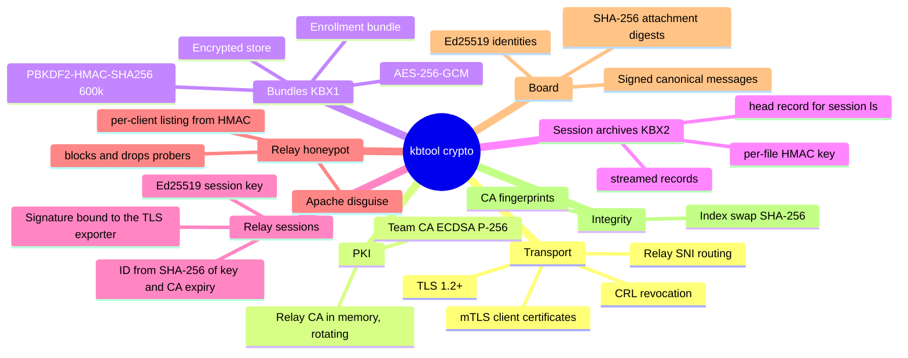

## 2. Keys and secrets

Every secret kbtool handles, where it lives, and how long it lives:

| Secret | Created by | Stored | Lifetime |
|---|---|---|---|
| Team CA key `ca.key` | the session host, when it issues the session's certificates (`collaborate host`; `collaborate resume` and `relay move` when they renew) | state dir, mode 0600 | until the session issues new certificates (they default to 24h, `-expire`) |
| Server key `server.key` | the session host, with the CA | state dir, 0600 | same |
| Client key `client.key` | the session host; attendees receive it at `collaborate attend` | state dir, 0600 | same as its certificate |
| Enrollment key (16 bytes) | daemon at every boot | memory only; printed inside the `kb1…` token and the daemon log (0600) | until the daemon restarts |
| Relay CA and leaf keys | relay at start and every rotation | memory only | replaced every `-rotate` (12h); the certificates show a disguised ten-year validity |
| Relay operator certificate key (optional) | operator (`-cert`/`-key`) | operator's file; read at start and on `SIGHUP` | operator-managed |
| Relay session key (Ed25519 seed) | the session host, with the certificates | daemon state dir `relay-session.key`, 0600 | until the session issues new certificates (the session it proves expires with the team CA) |
| Relay registration token | operator | relay: `config.json` or `KBTOOL_RELAY_TOKEN`; daemon host: `relay.json` (0600) | operator-managed |
| State dir key (`KBTOOL_SECRET`) | operator | memory only; supplied by `-db-key-env`, `-db-key-file`, `KBTOOL_SECRET`, or a prompt (never in an encrypted state dir); the session's daemon receives it in its environment; one key for `kb.db` and every session archive | until `kbtool kbx rekey` |
| Relay honeypot key (32 bytes) | relay at start | memory only | until the relay stops |
| Board seed (32 bytes) | `board_signup` / `kbtool board signup` | `kbtool board signup` and `board_signup` through `kbtool mcp` or `kbtool call` write it to the session directory's `.kbtool-seed` (0600) and strip it from what the agent sees; the board keeps only the public key | as long as the seed file keeps it |
| Finished session state | `collaborate finish` | `sessions/<id>/state/` (0700, file modes kept): the session's keys, certificates, index and board. In an encrypted state dir the whole session is sealed into a randomly named `sessions/<random>.kbx` and the plain directory removed | until the session is resumed |
| Inner `kb.db` key | `collaborate finish` (encrypted state dir) | the final keys record of the session's `.kbx`, never extracted to disk | until the session is resumed (the `kb.db` is then re-encrypted with the current key) |
| Relay session ID (128 bits) | derived: SHA-256(label, session public key, CA expiry) | `config.json`, every client's `client.json` | until the team CA expires or the session issues new certificates; **not a secret** (it travels as SNI) |

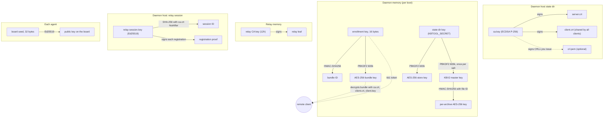

## 3. Randomness

All secrets and unique values come from `crypto/rand` (the operating system's
CSPRNG): ECDSA keys, certificate serials (uniform below 2^159, as RFC 5280
allows), the 16-byte enrollment key, PBKDF2 salts, KBX1 GCM nonces, KBX2
file IDs, relay session keys, relay connection IDs, board seeds, and the
relay honeypot's key and words. KBX2 nonces are not random: they are the
record index and flags under a key that is unique to the file, so they never
repeat under one key. `math/rand` is used only for the jitter on the
daemon's relay reconnect delay, where it protects nothing.

## 4. The team PKI (session certificates)

A session host with relays enabled (`kbtool relay self-host start` or
`kbtool relay join URL`) creates a private certificate authority for its
daemon and the session's attendees: at `collaborate host`, and again when
`collaborate resume` (expired certificates, or a local session opened to
collaborators) or `relay move` renews them. A local session (no relay
enabled) issues none. Nothing is signed by a public CA.

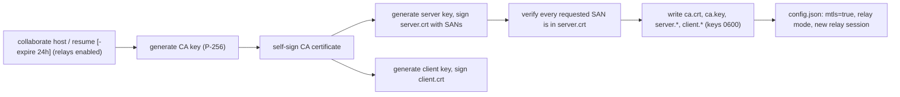

Certificate profiles:

| Field | CA | Server and client leaves |
|---|---|---|
| Key | ECDSA P-256 | ECDSA P-256 (one key each) |
| Signature | ECDSA with SHA-256 | ECDSA with SHA-256, by the CA |
| Serial | random, below 2^159 | random, below 2^159 |
| Subject | `CN=kbtool local CA, O=kbtool` | `CN=<role>, O=kbtool` |
| Validity | 1 hour back-dated to `-expire` (default 24h) | same |
| Key usage | CertSign, CRLSign; `IsCA` | DigitalSignature |
| Extended key usage | — | ServerAuth **and** ClientAuth |
| SANs | — | server: every joined relay host, plus this machine's addresses when self-hosting |

The relay's own in-memory certificates differ on purpose, so that they look
like a sysadmin's self-signed ones and never name kbtool (section 12.7): CA
`CN=Easy-RSA CA` with no organization; leaf `CN=<host name>`, SANs the host
name plus `-ip`/`-dns`, ServerAuth only; both valid for ten years from a
random date 30 to 365 days before the relay started.

Notes:

- **SANs:** attendees verify the relay host they dial, so every joined relay
  host is a SAN, and the session can start on (or move to) any of them.
  With the self-hosted relay, attendees dial this machine, so its addresses
  are SANs too: every interface IP (not link-local), the host name, and
  `host.docker.internal`. Each SAN is checked in the issued certificate
  before anything is written.
- **One client certificate for everyone:** every enrolled client receives the
  same `client.crt` and `client.key`. TLS has no per-certificate uniqueness,
  and the CRL revokes that one shared identity (section 10).
- **The CA fingerprint** is SHA-256 over the CA certificate's DER bytes,
  written as unpadded base64url (43 characters). It is shown for humans and
  logs; no protocol depends on it.

## 5. Encrypted bundles (KBX1)

Two things use the same container format: the **enrollment bundle** a client
downloads, and the **encrypted store** (`kb.db` holding the index and the
message board).

### 5.1 Format

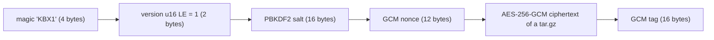

- The plaintext is a deterministic tar.gz: the enrollment bundle holds
  `ca.crt`, `client.crt`, `client.key` and `client.json`; the store holds
  `kb.db` and, when present, `board.bin`.
- No associated data is used. The header is not authenticated separately:
  changing the salt or nonce makes GCM authentication fail.
- A wrong passphrase, a wrong token, or any tampering surfaces as a GCM
  authentication failure. Nothing is decrypted partially.

### 5.2 Key derivation

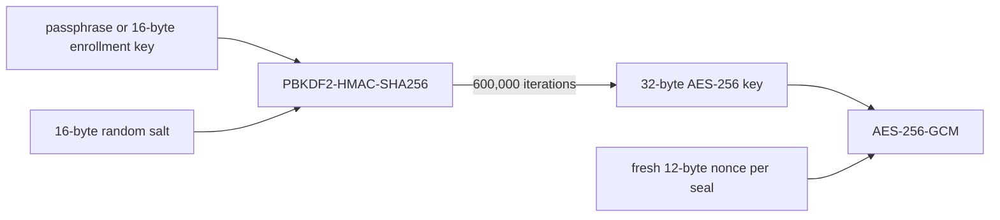

PBKDF2 is implemented in kbtool itself (RFC 2898 over `crypto/hmac`),
because the standard library has no PBKDF2.

**Derive once, seal many.** A `bundleSealer` caches the derived key for its
salt:

- The daemon derives the enrollment bundle key **once at boot** and seals
  each download with that salt and a fresh nonce. A flood of bundle
  requests costs the server no PBKDF2 work.
- A store derives its key once when it is opened. Every later board or index
  save reuses it with a fresh nonce.
- Opening a bundle under a different salt costs one derivation; when it
  succeeds, that salt and key become the cached ones.
- The client pays the full 600,000 iterations once per enrollment. That cost
  is the brute-force barrier on a captured bundle.

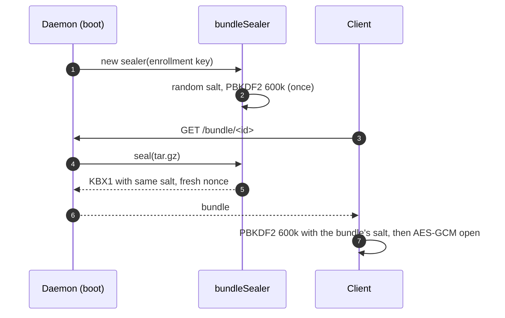

Bundles written before the iteration count rose from 100,000 do not open:
there is no version flag for the count, so they fail like a wrong key.

## 6. Encryption at rest (the store)

With a passphrase, `kb.db` becomes a KBX1 bundle that holds both the index
and the message board, so the two can never be out of step and the board is
never written in plaintext.

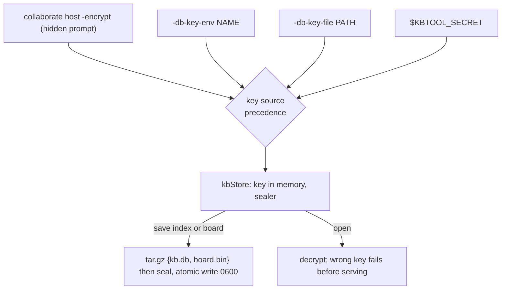

- **The key never touches disk.** It is not written to `config.json`, argv
  or any file kbtool owns. The session's daemon receives it from kbtool
  through the `KBTOOL_SECRET` environment variable.
- **Every save re-seals both parts** under the in-memory key. Saves run under
  the store lock (`kb.db.lock`), so concurrent board writers cannot lose each
  other's updates.
- **Live reindex.** `kbtool build` on the session host builds the index
  in the client process and streams it over the unix socket. The daemon
  re-seals it with the current board under its own key and the store lock.
  The client never needs the passphrase, and no plaintext is written
  (section 11).
- **Mixed states are refused.** An encrypted `kb.db` next to a stray plain
  `board.bin`, or the reverse, stops the daemon.
- **No prompt in an encrypted state dir.** In a plain state dir a command
  that opens an encrypted store may ask for the key on a terminal. Once
  session.json has `"encrypt": true`, every command that needs the key fails
  without one instead of prompting.

## 6a. Session archives (KBX2)

In an encrypted state dir (`collaborate host -encrypt`, session.json
`"encrypt": true`) a finished session is one KBX2 file,
`sessions/<random>.kbx`, named with 128 random bits (32 lowercase hex
characters). Unlike KBX1 it is a stream of records, so a reader can stop
early: `kbtool session ls` decrypts only the head record. The name carries
nothing: the session's ID and everything else come only from the
authenticated head, and `kbx rekey` gives every archive a new random name.

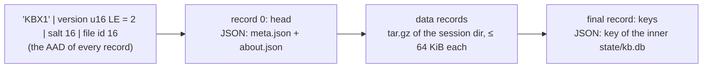

- **Record:** `flags u8 | length u32 LE | AES-256-GCM ciphertext+tag`. The
  nonce is the record index (u64 BE) followed by the flags (u32 BE), and the
  header is the associated data, so records cannot be reordered, dropped,
  moved to another file or re-flagged. A file without its final record is
  reported as truncated.
- **Keys:** master key = PBKDF2-HMAC-SHA256(secret, salt, 600,000); file key
  = HMAC-SHA256(master, `"kbtool kbx2 file key"` ‖ 0 ‖ file id). The random
  file id gives every file its own key even when files share a salt. New
  archives in a state dir reuse the salt of an existing one, so listing many
  sessions costs one derivation.
- **Head:** the session's `meta.json` (ID, role, dates, working directory,
  certificate options) and `about.json`. The board seed is in the payload, not the
  head, so listing never decrypts it.
- **Payload:** a tar.gz made from inside the session directory (paths
  relative to it), with the kbtool state in `state/`. The inner `kb.db` is
  still a KBX1 store.
- **Keys record:** the key of the inner `kb.db`. `kbtool kbx rekey` re-encrypts
  only outer files record by record and keeps this record, so no inner file
  is rewritten. On `resume` the inner `kb.db` is re-encrypted with the
  current key as it moves to `<state>/kb.db`; the recorded key is never
  written to disk.
- **Reading a sealed session without resuming it.** `kbtool board dump
  -session ID` streams the archive, decrypts it in memory, and opens the
  inner `kb.db` with the key from the keys record. `kbtool memory export`,
  `consensus export` and `deliverables export` with `-session ID` copy that
  one directory out of the stream. Nothing is extracted to the state dir,
  but what they produce (the HTML page, the tar.gz) is plaintext wherever
  you write it.
- **Rekeying** (`kbtool kbx rekey`) gives all files of the state dir one new
  salt, and skips files that already open with the new key, so an
  interrupted run can be repeated ([kbx.md](kbx.md)).

## 6b. What is plaintext on disk (encrypted state dir)

Encryption at rest covers the store and finished sessions. Everything the
running team needs in the clear is protected by file permissions only (0600
files, 0700 directories):

| When | Encrypted | Plain |
|---|---|---|
| No session active | `kb.db` is not present (it is sealed inside a session); every `sessions/*.kbx` | `session.json` (the current session's ID); `relay.json` (holds the relay registration token) |
| A session is active | `kb.db` (index and board); the other sessions' `.kbx` | the session directory (`.kbtool-seed`, `memory/`, `consensus/`, `deliverables/`, `meta.json`, `about.json`); the team PKI keys (`ca.key`, `server.key`, `client.key`), `relay-session.key`, `config.json`, `client.json`; the daemon log (it holds the `kb1…` enrollment token) |
| After an unclean shutdown | as for an active session | as for an active session, until `kbtool session validate` seals it |

**Finishing** (`collaborate finish`, `daemon stop`, SIGTERM or SIGINT on the
daemon) moves the state into `sessions/<id>/state/`, writes
`sessions/<random>.kbx.tmp`, reads it back and authenticates every record through
the final one, renames it
into place, and only then removes the plain directory. A crash at any point
leaves either the plain directory or a verified archive, never neither.

**Unclean shutdown.** A host daemon that dies without finishing (SIGKILL,
a crash, power loss) leaves the active session and the state plain. kbtool
detects this (encrypted state dir, an active host session whose plain
directory exists, no daemon process or socket answering) and then refuses
every command except `kbtool session validate`, `help` and `version`, so no
new plain state is created on top. `session validate`, given the key:

- removes leftovers of interrupted work (`*.kbx.tmp`, `*.rekey`,
  `.<id>.extract`) and the dead daemon's pid file and socket;
- completes a finish that had already sealed a verified archive;
- otherwise requires the state to be sound before sealing it: `kb.db` is KBX1,
  opens with the key, and its index and board parse; no plain `board.bin`;
  `config.json` and the certificates parse;
- on success seals the session exactly like `finish`.

The daemon removes its pid file only after it has sealed, so a graceful stop
in progress is never mistaken for an unclean shutdown.

**Removal is not erasure.** Plain files are deleted with ordinary unlinks.
Their blocks may survive on the disk, in file system journals, on SSDs after
wear levelling, and in backups or snapshots taken while a session was
active. Use full-disk encryption where that matters.

## 7. The daemon's listeners

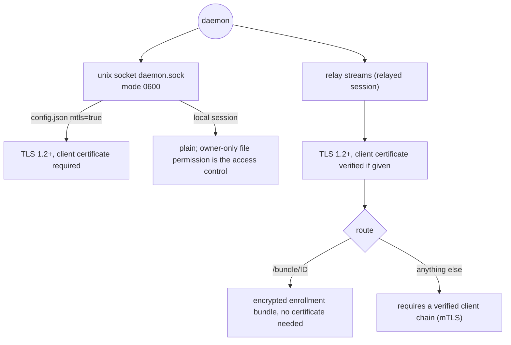

- **Unix socket.** The socket is created with umask 0177, so it is
  `srw-------`. In a relayed session (mTLS on) the socket also speaks TLS
  and requires the client certificate. The host's own CLI then presents the
  state dir's `client.crt`/`client.key` and expects the server
  certificate's first SAN.
- **Relay streams.** The daemon opens no TCP port of its own. Attendees
  reach it only through the session's relay (section 12), which splices
  their TLS to the daemon unopened:
  - TLS without a client certificate reaches only `/bundle/<id>`;
  - every API route requires a verified client chain.
- **No plain-HTTP API.** Through the relay every API route needs a client
  certificate; only a local session's owner-only socket is plain.

## 8. Mutual TLS between attendee and daemon

An enrolled attendee talks to the daemon over mutual TLS, end to end through
the relay's splice (section 12.3):

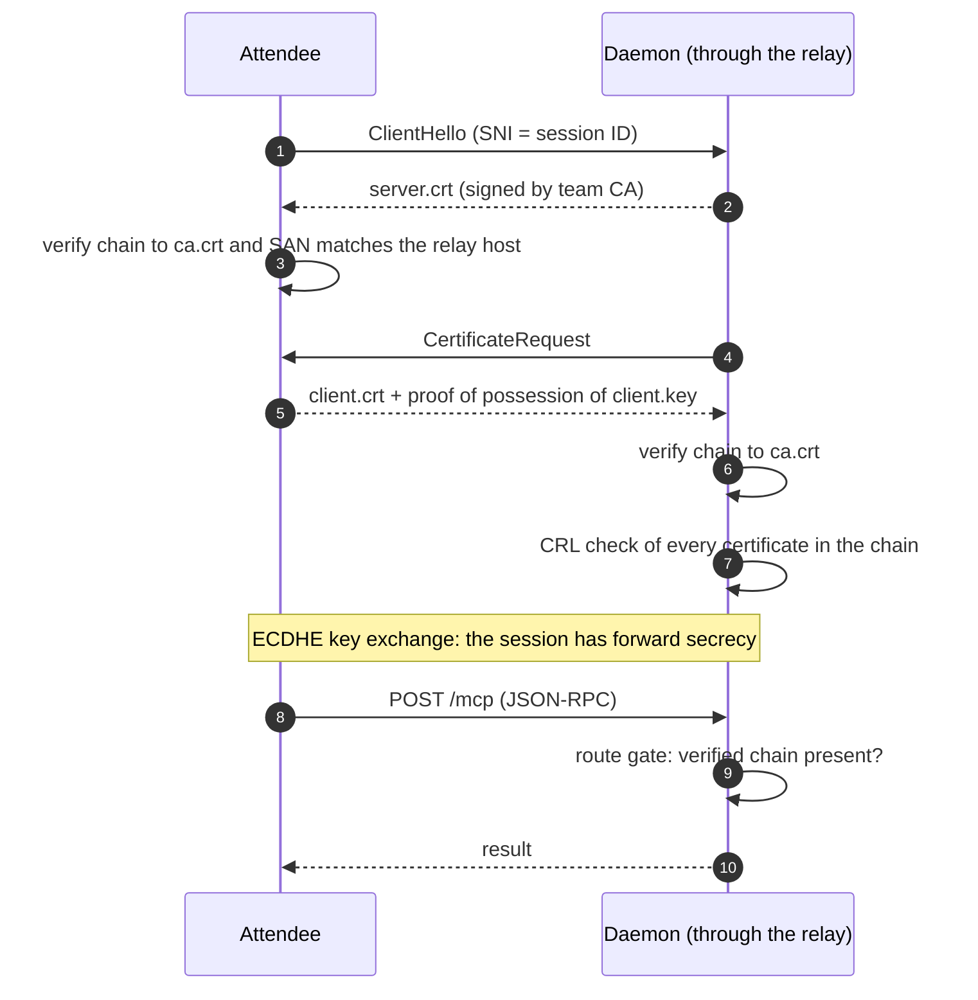

- The attendee trusts **only** `ca.crt` from its state dir (no system roots).
- The attendee checks the server's **name**: the relay host it dials must be
  one of the server certificate's SANs. With the self-hosted relay the host
  prints one enrollment line per address of its machine, and each is a SAN.
- The daemon checks the client certificate against the same CA and the CRL
  (section 10).

## 9. Enrollment (`kbtool collaborate attend`)

Enrollment gives a new machine the team's `ca.crt`, `client.crt` and
`client.key` with one pasted line, without trusting the network. The host's
daemon prints the line (`kbtool collaborate attend kb1…`) at every start;
an attendee whose certificates were renewed re-enrolls with
`kbtool collaborate resume kb1…`.

### 9.1 The token

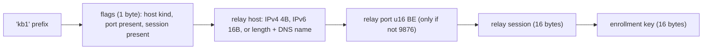

- Everything after `kb1` is unpadded base64url. The token carries the relay
  host, port and session as well as the key, so it is pasted alone.
- Parsing is strict: unknown flag bits, wrong lengths, an invalid host name,
  port 0 or trailing bytes are all refused.
- **The key is the only secret.** It is 128 random bits, generated at daemon
  boot and held in memory. A restart makes every old token useless.
- **Nothing else needs to travel.**
  - The bundle ID is derived from the key: `base64url(HMAC-SHA256(key,
    "kbtool bundle id")[:16])`. It cannot be found by scanning and reveals
    nothing about the key.
  - The team CA arrives inside the encrypted bundle, so no fingerprint is
    needed.

### 9.2 The protocol

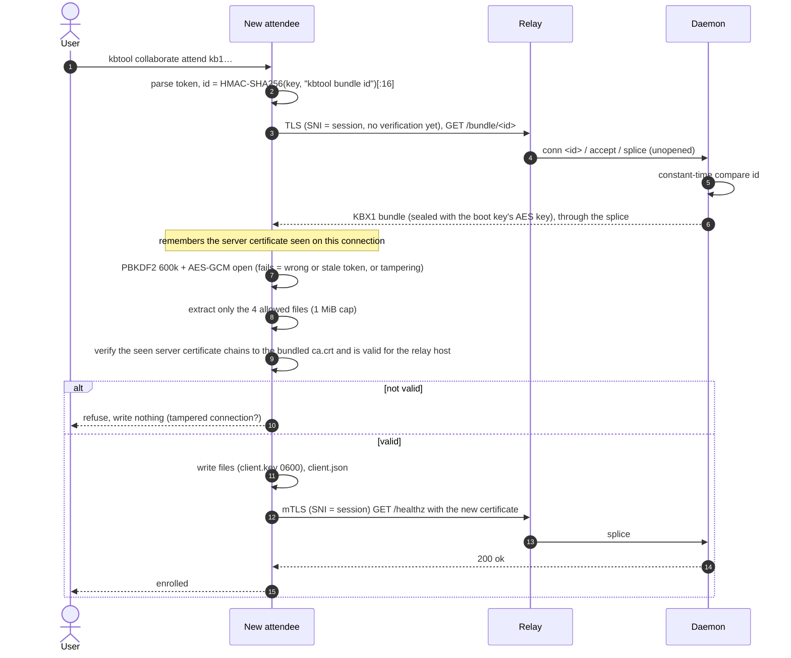

### 9.3 Why it is safe

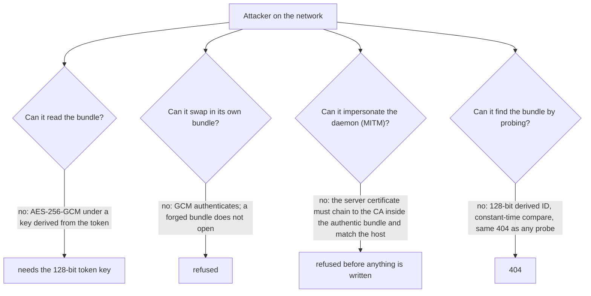

The token is a **bearer secret** while its daemon is up: anyone who has it can
enroll. Daemon logs that contain it are mode 0600. Restarting the daemon
revokes all outstanding tokens; the CRL revokes the shared client
certificate itself (section 10).

## 10. Revocation (CRL)

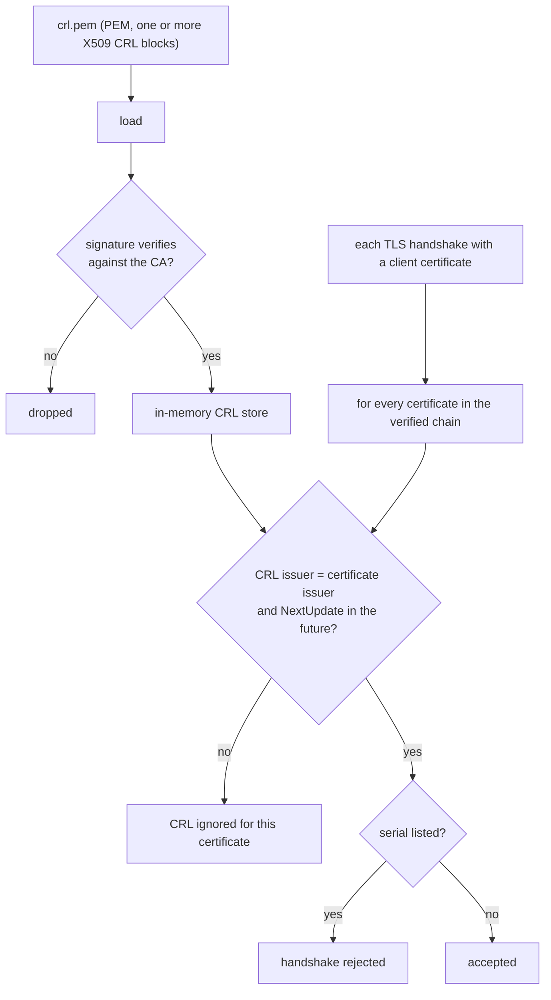

- **File:** `crl.pem` in the session host's state dir. The daemon watches
  it and reloads it when it changes.
- **Missing file:** no revocation data. Deleting the file clears the store.
- **Corrupt file:** the previous lists are kept, so a read hiccup never
  releases revocations.
- **Stale CRL** (NextUpdate in the past): ignored, so an old file can
  neither revoke nor deny service.

## 11. The host's unix socket and live reindex

On the session host the CLI reaches the daemon only through `daemon.sock`
(never the relay). Socket-only methods let `kbtool build` hand over a
new index:

```mermaid
sequenceDiagram
  autonumber
  participant B as kbtool build (host)
  participant S as daemon.sock (0600, TLS in a relayed session)
  participant D as Daemon
  B->>S: kbtool/index_info
  S-->>B: {db, encrypted}
  B->>B: build index in this process, sha = SHA-256(bytes)
  B->>S: {"method":"kbtool/index_swap","params":{"size":N,"sha256":sha}} + N raw bytes
  D->>D: size within 1..8 GiB, SHA-256 matches, bytes parse as an index
  D->>D: lock tools, board, store; persist (re-seal when encrypted)
  D-->>B: {chunks, db, encrypted}
```

- The SHA-256 here is an **integrity check** against truncation and
  corruption, not authentication. The socket's owner-only permission (and
  mTLS in a relayed session) decides who may swap.
- The swap methods do not exist over the relay or stdio.
- Two more socket-only methods follow the same rule:
  - **`kbtool/sessions`** serves the daemon's catalog of sealed session heads
    to a caller that presents `HMAC-SHA256(key, "kbtool session list v1")`
    (section 6a);
  - **`kbtool/steer`** has the `system` account post the session host's
    steering message and its attachments (`kbtool steer`). Only a process
    that can open the owner-only socket can steer, which is what makes it
    the host's privilege. Each attachment's SHA-256 is checked against the
    announced digest before anything is posted. The posts are signed with
    the `system` key like every system message, and agents cannot post
    `kind=steer`.
- **The session host's agent** is whoever last signed up through the
  socket. That is how the board knows which agent works for the host (the
  `[host agent]` tag in `board dump`). Only that agent, and only through the
  socket, may propose a consensus change with `host_accepted`, which
  accepts it without a vote. The same call from a remote client, or from
  another agent, is refused.

## 12. The relay

Attendees reach the session host's daemon only through a relay: a remote
one the host joined (`kbtool relay join URL`, run with `kbtool relay
run|start`), or the self-hosted relay inside the host's own daemon for a
LAN or VPN (`kbtool relay self-host start`, section 12.9). The daemon
connects **out** to the relay; attendees connect to the relay; the relay
copies bytes without decrypting the team's traffic.

### 12.1 Two layers of trust

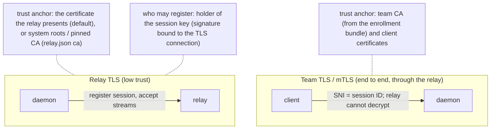

| Layer | Protects | Trust anchor |
|---|---|---|
| Relay TLS | the daemon's registration and its accept streams | by default whatever certificate the relay presents in the handshake (its CA fingerprint is reported), host names not checked; with the `relay.json` `ca` setting the system roots or a pinned CA, host name checked |
| Session proof | that only the session's daemon registers it | the daemon's Ed25519 session key; the session ID commits to its public key |
| Team TLS / mTLS | everything that matters: the enrollment bundle and all MCP traffic | the team CA and the shared client certificate |

In the default mode the relay TLS only keeps registrations private from
passive observers: an active attacker between daemon and relay could present
its own certificate and read
session IDs and the relay token, but never team traffic, and cannot enroll
or impersonate a daemon. Even that attacker cannot register a session: the
proof is signed over keying material of the TLS connection it travels on, so
it is useless on the attacker's own connection to the real relay. With
the `relay.json` `ca` setting, the token is protected too. The registration token is
compared in constant time.

### 12.2 One port, routed by the first bytes

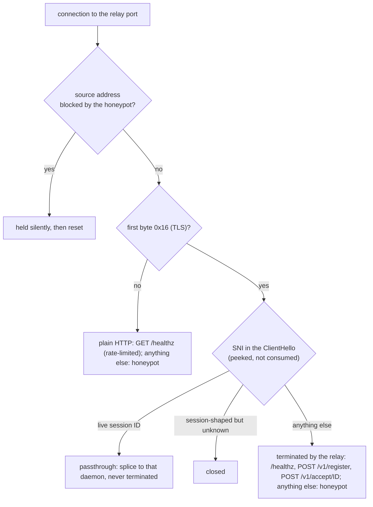

Every answer the relay itself gives, on either layer, carries the header
`Server: Apache` (no version, like `ServerTokens Prod`; no page signature, like `ServerSignature Off`). Paths that are not kbtool endpoints get
the honeypot (section 12.8), never a kbtool error.

### 12.3 Registration and a relayed client connection

```mermaid
sequenceDiagram
  autonumber
  participant D as Daemon
  participant R as Relay
  participant C as Client
  D->>R: TLS handshake (default: accept the presented certificate; pinned: verify it and the host name)
  D->>D: ekm = TLS exporter("kbtool relay register v1", 32 bytes)<br/>sig = Ed25519(session key, label, session, expiry, ekm)
  D->>R: POST /v1/register, Upgrade, X-Kbtool-Session, X-Kbtool-Session-Key, -Expires, -Sig, X-Kbtool-Relay-Token
  R->>R: per-IP rate, token (constant time), ID = SHA-256(key, expiry), same ekm, verify sig, not expired, under the cap, not already live
  R-->>D: 101 Switching Protocols: control stream (closed at expiry)
  loop every 30 s
    R->>D: ping
    D-->>R: pong
  end
  C->>R: TLS ClientHello with SNI = session ID
  R->>R: peek SNI, find session
  R->>D: control: "conn <random id>"
  D->>R: new relay TLS, POST /v1/accept/<id> (X-Kbtool-Session)
  R-->>D: 101: raw stream
  R->>R: splice client <-> daemon stream
  Note over C,D: Team TLS handshake runs end to end through the splice
  C->>D: (encrypted) client certificate, MCP calls
  D-->>C: (encrypted) results
```

Inside the splice:

- The daemon presents `server.crt` with the team CA appended to the chain.
- The client sends SNI = session (the relay's routing key). It still
  verifies the server certificate against the team CA **for the relay's host
  name**. The session host puts every joined relay host in the server
  certificate's SANs (section 4), so the session can start on (or be moved
  to) any of them without new certificates. That gives a relay nothing: presenting the
  certificate still takes the daemon's private key.
- The relay sees only TLS records. It learns metadata: session IDs, timing
  and byte counts.

### 12.4 The session proof

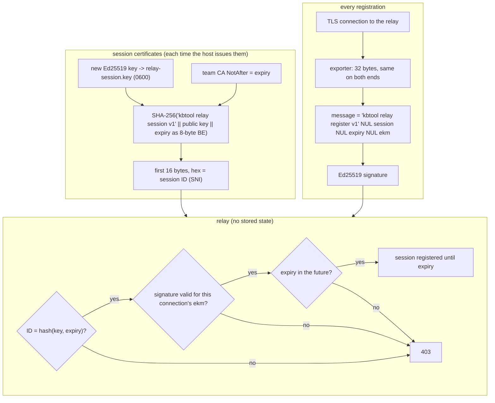

- **No squatting.** A session ID is useless without its key; the relay
  refuses registrations without a proof (older daemons).
- **No replay.** The exporter output is unique to each TLS connection, so a
  captured registration fails on any other connection, including through a
  man in the middle who terminates the daemon's TLS.
- **Expiry.** The ID commits to the team CA's `NotAfter`. The relay refuses an
  expired session and closes a live one at that moment, so a session never
  outlives the certificates that make it useful.
- The daemon checks at start that `relay_session` matches its key and
  `ca.crt`, and refuses relay mode otherwise.

### 12.5 Abuse limits

| Limit | Default | Option |
|---|---|---|
| Registered sessions | 5000 (503 above) | `-max-sessions`, `KBTOOL_RELAY_MAX_SESSIONS`, `relay_max_sessions` |
| New connections per source IP | 20/s, burst 100 (closed at once) | `-conn-rate`, `KBTOOL_RELAY_CONN_RATE` |
| Registrations per source IP | 30/min, burst 10 (429) | `-register-rate`, `KBTOOL_RELAY_REGISTER_RATE` |
| Control line | 128 bytes, both ends | — |
| Streams per session / total | 64 / 1024 | — |
| `/healthz` answers | one per interval for all callers together, 1000 ms (429 with `Retry-After`); 0 = unlimited | `-healthz-interval`, `KBTOOL_RELAY_HEALTHZ_INTERVAL` |
| Honeypot blocks | 15 min on becoming suspicious, 1 h for each probe while suspicious | `-honeypot-block`, `-honeypot-reblock` (ms), `KBTOOL_RELAY_HONEYPOT_BLOCK`, `KBTOOL_RELAY_HONEYPOT_REBLOCK` |
| Honeypot memory | clients remembered 2 h after their last answered request; table capped at 10% of the memory available at start (512 bytes a client, at least 1024 clients), oldest evicted first | `-honeypot-remember` (ms), `-honeypot-max-memory`, `KBTOOL_RELAY_HONEYPOT_REMEMBER`, `KBTOOL_RELAY_HONEYPOT_MAX_MEMORY` |
| Held dropped connections | 4096 at once, each held 1 min; beyond that, reset at once | — |

### 12.6 Enrollment through a relay

Enrollment (section 9.2) always goes through the session's relay:

- the token carries the relay host, port and session;
- the bundle download uses SNI = session, so the relay routes it to the
  daemon unopened;
- the attendee verifies the server certificate it saw against the bundled CA
  for the relay host.

### 12.7 The relay's certificate: in memory and rotating, or the operator's

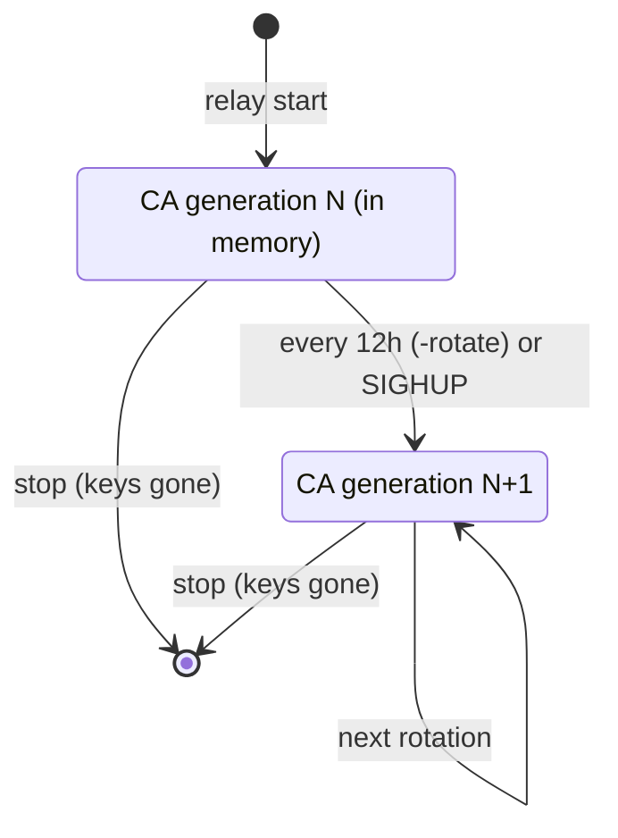

- At every start the relay generates a new CA and leaf (ECDSA P-256). It
  never writes them, and it deletes any `relay-ca.*`/`relay.*` files older
  versions left behind.
- **Disguise.** Anyone can open a TLS connection to the relay, so its
  certificates must not give it away. The CA is `CN=Easy-RSA CA`; the leaf's
  CN is the host name and its SANs are the host name plus `-ip`/`-dns` (no
  interface addresses, so no internal network leaks), ServerAuth only. The
  handshake sends `[leaf, CA]`, like a server configured with its own CA.
  Every certificate of one relay process carries the same validity, chosen
  once per process: from a random 30 to 365 days before the start, for ten
  years. A 12-hour certificate would mark the relay as unusual; this one
  looks like a long-lived self-made certificate, while the keys behind it
  still change at every rotation. The relay serves no `/ca.crt`: that path
  is an ordinary honeypot 404.
- **Rotation** swaps the chain presented to new handshakes. Established
  connections are untouched, because certificates are only checked at the
  handshake. Default-mode daemons accept the presented certificate, so they
  follow a rotation with nothing to fetch.
- **Operator certificate.** With `-cert`/`-key` the relay serves that chain
  instead and never rotates; `SIGHUP` reads the files again. Default-mode
  daemons report the chain's last certificate as the fingerprint, and
  daemons whose `relay.json` sets `ca` (`system` or a file) verify it
  properly, host name included.

**Reconnects.** If the control stream drops, or the relay is down, the daemon
re-registers the same session forever. It waits with jittered exponential
backoff: the ceiling doubles from 1 s to 30 s, and each wait is between half
the ceiling and the ceiling. In the default trust mode a restarted relay with
a brand-new CA is accepted as presented.

### 12.8 The honeypot: an Apache disguise for probers

The relay's public port must answer anyone, so it is scanned. It does not
announce itself. Every answer it gives itself claims to be Apache httpd,
and any path that is not a kbtool endpoint gets an Apache directory listing
or an Apache error page; the listing's icons are Apache's own files under
`/icons/`, so hashing them also says httpd. kbtool's own clients and daemons only use
`/healthz`, `/v1/register`, `/v1/accept/…` and SNI passthrough,
so no kbtool workflow ever touches the honeypot.

```mermaid
stateDiagram-v2
  [*] --> Unknown
  Unknown --> Seen: GET /
  Seen --> Suspicious: GET /<fake dir>, blocked 15 min
  Unknown --> Suspicious: GET /<fake dir>, blocked 15 min
  Suspicious --> Suspicious: a fake dir again after the block, blocked 1 h
  Seen --> [*]: 2 h with no answered request, or evicted
  Suspicious --> [*]: 2 h with no answered request (never while blocked), or evicted
```

- **The listing.** At start the relay makes 32 random words, a fake date
  for each, and a 32-byte key (all `crypto/rand`; no word is `ca.crt`,
  `healthz`, `v1` or another name a real server would have). Each client
  sees 1 to 5 of the words as directories: the bits of a 32-bit mask taken
  from HMAC-SHA256(key, client address). The mask is computed on each
  request and never stored, so the listing costs no memory per client
  (4 bytes while it is being rendered). It is the same over HTTP and
  HTTPS and for as long as the relay runs, so reloading or switching
  scheme gives nothing away. It reveals nothing about sessions, daemons or
  the relay's configuration. The word count is fixed.
- **Seen and suspicious.** `GET /` marks a client seen. Requesting any of
  the 32 fake directories, which only someone who read a fake listing
  would do, makes it suspicious and blocks it. Other unknown paths get a
  404 and change nothing.
- **Blocking.** A blocked address is refused before anything else,
  including passthrough to daemons. A user-space process cannot drop
  packets, so the relay accepts the connection, never reads or writes a
  byte, holds it for a minute and then resets it. To the client it looks
  like a dead server. Dropped traffic does not count as activity; only
  answered requests refresh a client's last-seen time.
- **Bounded memory.** The client table is a least-recently-seen list capped
  by a memory budget (section 12.5). A swarm of new addresses evicts the
  oldest clients instead of growing memory, so a relay on a small host
  stays up, and more memory makes the protection longer-lived. Eviction can
  release a blocked address early. This table is separate from the
  per-IP rate limiter, which keeps refusing new addresses when its own
  100,000-entry table is full.
- **`/healthz` rate limit.** `/healthz` answers at most once per interval,
  whoever asks, so it cannot be used to measure the relay or burn its CPU.
  `kbtool relay join`, which checks `/healthz`, waits for `Retry-After`
  and retries.
- **Local control.** `kbtool relay honeypot ls | rm IP… | clear
  [-suspicious]` talks to the running relay over `<state>/relay.sock`. The
  socket is created under umask 077 and set to mode 0600, so file
  permissions are its only access control, as for the daemon socket.
  `ls -json` can feed an external firewall that drops packets for real.

### 12.9 The self-hosted relay (LAN or VPN)

With `kbtool relay self-host start` the session host's daemon hosts the relay
itself, in memory, and its sessions use it instead of any joined relay.

- **Same relay server.** It is the relay of sections 12.2 to 12.8 (session
  proof, SNI passthrough, honeypot, `Server: Apache`), listening on all
  interfaces at `relay.json` `selfhost_port` (drawn once from 20000-32767
  and kept).
- **Its own certificate.** A disguised in-memory CA and leaf as in section
  12.7, with this machine's addresses as SANs, replaced every 12 hours. It
  has no pid file, log, control socket or operator certificate.
- **Registration.** The daemon registers over loopback with the
  `relay.json` `selfhost_token`: 128 random bits made once and kept (mode
  0600). Port and token are kept, so the relay stays personal and enrolled
  attendees keep working across restarts and resumes.
- **Attendees** dial one of this machine's addresses, one enrollment line
  per address. The team certificates name those addresses (section 4); a
  session whose certificates do not cover them is served locally only until
  `collaborate resume` issues new ones.

## 13. Message board signatures

Agents that cannot see each other's workspaces coordinate on a signed board.
Every message is signed with the author's Ed25519 key; readers see a
verification status on each message.

### 13.1 Identity

```mermaid
sequenceDiagram
  autonumber
  participant A as Agent
  participant K as kbtool (session layer)
  participant B as Board (daemon)
  A->>K: board_signup {"name":"alice"}
  K->>B: board_signup
  B->>B: seed = 32 random bytes, Ed25519 key from seed
  B->>B: under the board lock: bind name <-> public key permanently
  B-->>K: seed (64 hex) — shown once, the board keeps only the public key
  K->>K: store the seed in the session's .kbtool-seed (0600)
  K-->>A: reply without the seed
```

A name is bound to one public key for the life of the board; a second
signup with the same name is refused.

- **Seed custody.** `kbtool mcp` (stdio), `kbtool call` and
  `kbtool board` wrap the board tools in a session layer. It
  stores the seed from `board_signup` in the session's `.kbtool-seed`
  (0600), removes it from the reply, and adds it to every later board call,
  so the agent never sees or repeats its seed. The seed still travels from
  the daemon to the client once, inside the team's mTLS (on the session
  host, over the owner-only socket).
- **Platform.** The signup also records the OS and CPU of the client binary
  (`GOOS/GOARCH`, fixed at build time; 64 bytes at most, checked before any
  seed is made). It is **reported by the client and not verified**, and
  not signed: treat it as a label. Only `board_whoami` and `board dump`
  show it.

### 13.2 Signing and verifying

The signature covers a **canonical string**: the fields joined with NUL
bytes, so no field can be re-split into another:

```text
agent \0 thread \0 seq \0 kind \0 task \0 sorted,refs \0 text [\0 attachment:sha256:<hex>]
```

```mermaid
flowchart TB
  subgraph post["board_post (author side, inside kbtool with the seed)"]
    S1["seed"] --> K1["Ed25519 private key"]
    M1["message fields"] --> CAN["canonical string"]
    ATT["attachment tar.gz (optional)"] --> D1["SHA-256 digest"] --> CAN
    K1 --> SIG["Ed25519 signature over the canonical string"]
    CAN --> SIG
  end
  subgraph read["every read"]
    R0{"author registered?"} -->|"no"| U["unknown-agent"]
    R0 -->|"yes"| R1{"message key = registered key?"}
    R1 -->|"no"| IMP["impersonation"]
    R1 -->|"yes"| R2{"Ed25519 verify?"}
    R2 -->|"no"| BAD["bad-signature"]
    R2 -->|"yes"| R3{"attachment bytes hash to the signed digest?"}
    R3 -->|"no"| BAD
    R3 -->|"yes or no attachment"| VER["verified"]
  end
  SIG --> read
```

- The board itself never stores a seed, only the public key. The seed
  lives in the session directory's `.kbtool-seed` (0600), written
  by `kbtool board signup` or the session layer (section 13.1). Each signing call sends the
  seed to the daemon, which derives the key, signs, and keeps nothing. In an
  encrypted state dir the seed is plain while its session is active and
  sealed in the session's `.kbx` once it finishes.
- **Attachments** are signed through their SHA-256 digest. Swapping the
  stored bytes turns the message into `bad-signature`, and `board fetch`
  refuses data whose digest differs from the signed one. Attachments go
  through the agent's memory directory: attaching reads
  files from there and fetching writes there, never to arbitrary paths.
- **Consensus.** Proposals and votes are ordinary signed agent posts in the
  `consensus` thread, and outcomes are `system` posts. The accepted files
  come from the signed attachments of the accepted proposals. The daemon
  builds every background sync from them and checks each file against the
  SHA-256 recorded when it was proposed; clients trust the daemon for this,
  as for the board itself. Only the session host's agent, through the
  daemon socket, can skip the vote (section 11).
- **Board state outside messages.** Agent platforms (an `AGT1` trailer) and
  the consensus state (proposals, votes, accepted files: a `CNS1` trailer)
  are stored with the board and are not signed. Like the messages, they
  are as trustworthy as whoever controls the board file.
- **What signatures do not do:** they prove *who* wrote a message, not that
  the board is complete or fresh. Whoever controls the board file can delete
  or withhold messages. When the store is encrypted, the board is
  confidential at rest (section 6); otherwise `board.bin` is plaintext,
  protected by file permissions.

## 14. Threat model summary

```mermaid
flowchart LR
  subgraph who["Who"]
    N["network observer"]
    SC["internet scanner or bot swarm"]
    M["active MITM"]
    RO["relay operator"]
    TH["token holder"]
    LU["other local user on the host"]
    SU["process running as the same user"]
    DT["disk thief"]
  end
  subgraph what["What they get"]
    N --> N1["TLS metadata; session IDs (SNI); the public team CA"]
    SC --> SC1["sees an Apache server; probing blocks it; a swarm evicts old entries but cannot exhaust relay memory"]
    M --> M1["cannot enroll, read, or impersonate; can drop traffic"]
    RO --> RO1["metadata and byte counts; can drop traffic; never team plaintext"]
    TH --> TH1["can enroll while that daemon is up (bearer secret)"]
    LU --> LU1["no access to daemon.sock (0600) or keys (0600)"]
    SU --> SU1["everything the user can read: keys, the active session, the daemon's environment (KBTOOL_SECRET)"]
    DT --> DT1["encrypted state dir: kb.db and finished sessions need the key (PBKDF2 600k), but an active or crashed session, the PKI keys and relay.json are plain; plain state dir: everything"]
  end
```

| Asset | Protected by | Main residual risk |
|---|---|---|
| MCP traffic | TLS 1.2+ with ECDHE, mutual certificate authentication, CRL | a leaked shared client key; revoke it with the CRL |
| Enrollment | token-derived AES-256-GCM bundle, CA-inside-bundle server check | the token while its daemon is up |
| Relay registration | Ed25519 session proof bound to the TLS exporter, expiry with the team CA, constant-time token check, relay TLS (the presented certificate, or the `relay.json` `ca` setting) | default mode: an active MITM between daemon and relay can see the token and session IDs (but cannot register) |
| Relay availability | session cap, per-IP connection and registration rates, stream limits, bounded control lines, `/healthz` once per interval, honeypot blocks, memory-capped client table | a distributed flood from many addresses; one NAT shares a budget and a block; anyone can use up the `/healthz` answers, so a monitor may see 429 |
| Relay discovery | Apache disguise on every non-kbtool path and in every `Server` header; the listing and blocks never touch kbtool endpoints | it hides the product from casual scans, not from someone who knows kbtool's paths or watches its traffic |
| Relay control | `relay.sock`, mode 0600 in the relay's state dir | any process running as the relay's user can list, unblock or clear clients |
| Store at rest | AES-256-GCM with a PBKDF2 key | weak passphrases (PBKDF2 is not memory-hard) |
| Finished sessions (encrypted state dir) | KBX2: AES-256-GCM records with a per-file HMAC key, header as associated data, a required final record; random file names, identity only in the head | weak passphrases; the number, sizes and times of archives are visible |
| Active session and its state | file permissions (0600/0700); sealed at finish; unclean shutdowns blocked until `session validate` seals | a disk thief or same-user process while it is active or before it is validated; deleted plaintext remnants |
| State dir key | never written by kbtool; no prompt in an encrypted state dir | the daemon's environment is readable by the same user; a `-db-key-file` is as safe as that file |
| Board authorship | Ed25519 signatures, permanent name-to-key binding | completeness and freshness are not guaranteed |
| Board seeds | kept by kbtool in the session's `.kbtool-seed` (0600) and never shown to the agent | same-user processes can read it |
| Consensus | signed proposals and votes, every other active agent must vote yes, `system`-signed outcomes, host-only bypass through the socket | the daemon decides who is active and builds the synced files; the host user can accept without a vote |
| Agent platform labels | 64-byte limit at signup | client-reported and unsigned: a modified client can claim anything |
| Steering messages | posted only through the owner-only daemon socket, signed by `system` | anyone running as the host user can steer; agents are told to confirm with their own human before acting |
| Daemon socket | owner-only permission, mTLS in a relayed session | any process running as the same user |

## 15. Limitations and deliberate choices

- **TLS 1.2 is the floor.** Go's defaults choose the cipher suites (AEAD
  suites with ECDHE only), and 1.3 is used when both ends support it.
- **Leaf certificates carry both ServerAuth and ClientAuth** (one profile
  for all leaves).
- **All clients share one client certificate.** Access is all-or-nothing per
  team, and revocation affects every holder. New certificates (a new
  session, or a renewal) rotate it, and attendees re-enroll with the new
  line.
- **Certificates default to 24 hours** (`collaborate host -expire`), so a
  long-lived team needs a longer expiry or renewals: `kbtool collaborate
  finish && kbtool collaborate resume` issues new ones once they expire,
  and attendees then run `kbtool collaborate resume kb1…` with the new line.
- **By default the relay's certificate is trusted as presented, every time.** This is
  intentional: the relay layer only adds privacy for registrations, and team
  security never depends on it; session ownership rests on the session key,
  not on the relay's certificate. Relay host names are not verified for the
  same reason. Pin the relay (`relay join -relay-ca system` or a CA file) for a relay on
  the internet with an operator certificate, so the token is protected too.
- **PBKDF2-HMAC-SHA256 with 600,000 iterations** follows current OWASP
  guidance for that function, but it is not memory-hard (unlike scrypt or
  Argon2, which are not in the standard library). The 128-bit enrollment key
  is random, so this only matters for human-chosen store passphrases.
- **One salt per state dir for KBX2.** New archives reuse the salt of an
  existing one so that listing many sessions costs one PBKDF2 derivation.
  Every file still has its own AES key (HMAC of the master key with a random
  128-bit file ID), so record nonces never repeat under a key. The trade-off:
  one successful guess of the passphrase opens every archive, which is true of
  a shared passphrase anyway.
- **Session archives hide contents, not existence.** File names are random
  and say nothing about the session, but the number of archives, their
  sizes, record counts and modification times are visible. The head
  (session ID, working directory, certificate options, summary, participants) is
  encrypted like the rest. `session.json` names the current session's ID in
  the clear.
- **The session catalog is served on the daemon socket** to callers that
  present `HMAC-SHA256(key, "kbtool session list v1")`. That value is a
  fixed verifier, not a challenge response: anyone who captures it from the
  socket can replay it while the key is unchanged. The socket is owner-only,
  and such a process could read the active session anyway.
- **Deleted plaintext is not wiped** (section 6b). kbtool unlinks files; it
  cannot guarantee the blocks are gone.
- **No associated data in KBX1.** The magic and version are checked
  explicitly, and the salt and nonce feed the key and the GCM computation,
  so tampering with them still fails authentication.
- **SHA-256 on the index swap is integrity, not authentication.** The unix
  socket's permissions (and mTLS in a relayed session) are the authentication.
- **The honeypot is a disguise and a tripwire, not authentication.** It
  only judges requests outside kbtool's endpoints, so it never blocks a
  real client by itself, but everyone behind one NAT address shares a
  block. A blocked connection costs the relay a socket for a minute (at
  most 4096 at once) because user space cannot drop packets; feed
  `relay honeypot ls -json` to a firewall for true drops. A swarm larger
  than the client table evicts the oldest entries, including blocks, so
  more memory means longer memory. Blocks and the boot key live in memory
  only, and a restart forgets them along with the listing.
- **Fingerprints are informational.** The team CA fingerprint and the relay
  fingerprint printed by `relay join` help humans compare; no protocol step
  depends on them.

## 16. Where to look in the code

| Topic | Functions in `kbtool.go` |
|---|---|
| Certificates | `cryptoGenerateCA`, `cryptoGenerateLeaf`, `cryptoRandomSerial`, `caFingerprint`; issued for a session by `collaborateHost` and `collaborateResume` through `runMtls` |
| TLS configs | `cryptoServerTLSConfig`, `cryptoClientTLSConfig`, `bootstrapTLSConfig`, `hostSocketTLS` |
| CRL | `cryptoLoadCRLs`, `cryptoVerifyCRLs`, `cryptoCheckRevoked`, `cryptoMonitorCRL` |
| KBX1 bundles | `cryptoPbkdf2SHA256`, `cryptoBundleAEAD`, `bundleSealer.seal` / `.open` |
| KBX2 session archives | `newKBX2Writer`, `openKBX2`, `kbx2AEAD`, `sealSession`, `extractSession`, `readSessionHead`, `rekeyKBX2`, `rekeyDataDir` |
| Store at rest | `kbStore` (`writeBundle`, `saveBoard`, `saveDBBytes`, `lock`), `resolveKey`, `requireSecret` |
| Encrypted state dir | `encryptedDataDir`, `encryptDataDir`, `finishSessionNow`, `sealSessionDir`, `moveStateBack`, `daemonFinishSession`, `kbxMaster` |
| Unclean shutdown | `uncleanSession`, `refuseUncleanSession`, `validateUnclean`, `checkStateDir` |
| Session catalog | `sessionCatalog`, `sealedSessions`, `findSessionArchive`, `newSessionKBXPath`, `sessionListVerifier`, `Toolbox.sealedSessions` |
| Enrollment | `enrollToken.encode`, `parseEnrollToken`, `bundleIDFromKey`, `bootstrapState`, `bootstrapFetchBundle`, `bootstrapInstall` |
| Relay | `newRelayPKI`, `loadRelayOperatorPKI`, `relayServer` (`route`, `passthrough`, `handleRegister`), `verifyRegistration`, `ipLimiter`, `peekClientHelloSNI`, `relayConnector` (`run`, `once`, `accept`), `relaySessionID`, `relayRegisterMessage`, `relayEKM`, `relaySessionAuth`, `loadRelayAuth`, `relayTrust`, `relayFingerprint`, `relayCertWindow`, `relaySANs`, `relaySNIConfig` |
| Self-hosted relay | `selfRelay` (`start`, `endpoint`), `selfHostSettings`, `selfRelayEndpoint`, `selfHostCovered` |
| Relay honeypot | `honeypot` (`mask`, `listing`, `blocked`, `record`, `sweep`, `drop`, `serve`), `honeypotMaxClientsFor`, `healthzLimiter`, `relayServer.publicHandler`, `relayServer.serveControl`, `relayHoneypotCmd` |
| Board | `canonicalMsg`, `cryptoDeriveSeed`, `cryptoSignBoard`, `cryptoVerifyBoardMsg` |
| Session layer (seed custody, memory attachments) | `withSession`, `sessionExec` (`signup`, `editSchemas`), `injectSessionSeed`, `memoryAttachment`, `fetchAttachment` |
| Consensus | `consPropose`, `consVoteOn`, `consSettle`, `consApply`, `consTreeTarGZ` |
| Reading sealed sessions | `sessionBoard`, `boardFromState`, `exportSessionDir` |
| Live reindex | `handleHostMethod`, `Toolbox.swapIndex`, `swapIndexVia` |
| Steering | `doSteer`, `readSteerPayload`, `Toolbox.steer`, `Board.appendSystemMsg`, `systemNotice` |
