# Cryptography in kbtool

This document describes every piece of cryptography kbtool uses: the
algorithms and their parameters, which keys exist and where they live, the
file and token formats, and how each kind of connection is established and
trusted. It is written for people reviewing or operating kbtool, and it
follows the code in `kbtool.go` (standard library only; no third-party
crypto).

## 1. At a glance

| Purpose | Algorithm | Parameters | Go package |
|---|---|---|---|
| Certificates (team PKI, relay PKI) | ECDSA | P-256, random 159-bit serials | `crypto/ecdsa`, `crypto/x509` |
| Transport security | TLS | 1.2 minimum (1.3 negotiated when both sides can) | `crypto/tls` |
| Encrypted bundles (enrollment, store at rest) | AES-256-GCM | 12-byte random nonce, 16-byte tag | `crypto/aes`, `crypto/cipher` |
| Passphrase to key | PBKDF2-HMAC-SHA256 | 600,000 iterations, 16-byte random salt, 32-byte key | own RFC 2898 code over `crypto/hmac` |
| Message board signatures, relay session proof | Ed25519 | 32-byte seed, 64-byte signature | `crypto/ed25519` |
| Relay registration channel binding | TLS keying-material exporter | label `"kbtool relay register v1"`, 32 bytes (RFC 5705 / RFC 8446 §7.5) | `crypto/tls` |
| Bundle ID derivation | HMAC-SHA256 | key = enrollment key, message `"kbtool bundle id"`, truncated to 16 bytes | `crypto/hmac` |
| Fingerprints, digests, relay session ID | SHA-256 | CA fingerprint as 43-char base64url; attachment and index digests as hex; session ID = first 16 bytes | `crypto/sha256` |
| Secret comparison | constant time | bundle ID, relay token | `crypto/subtle` |
| Randomness | OS CSPRNG | all keys, salts, nonces, serials, session IDs, seeds | `crypto/rand` |

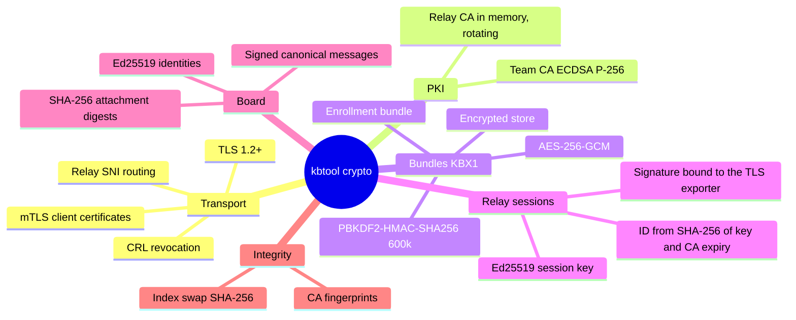

## 2. Keys and secrets

Every secret kbtool handles, where it lives, and how long it lives:

| Secret | Created by | Stored | Lifetime |
|---|---|---|---|
| Team CA key `ca.key` | `kbtool mtls` | state dir, mode 0600 | until the next `kbtool mtls` (certificates default to 24h, `-expire`) |
| Server key `server.key` | `kbtool mtls` | state dir, 0600 | same |
| Client key `client.key` | `kbtool mtls` (host), `client -import` (remote) | state dir, 0600 | same as its certificate |
| Enrollment key (16 bytes) | daemon at every boot | memory only; printed inside the `kb1…` token and the daemon log (0600) | until the daemon restarts |
| Relay CA and leaf keys | relay at start and every rotation | memory only | `-ca-ttl` (24h), replaced every `-rotate` (12h) |
| Relay operator certificate key (optional) | operator (`-cert`/`-key`) | operator's file; read at start and on `SIGHUP` | operator-managed |
| Relay session key (Ed25519 seed) | `mtls -relay`, `relay establish` | daemon state dir `relay-session.key`, 0600 | until the next `mtls` (the session it proves expires with the team CA) |
| Relay registration token | operator | `config.json`, or `KBTOOL_RELAY_TOKEN` | operator-managed |
| Store passphrase | operator | memory only; supplied by prompt, `-db-key-env`, `-db-key-file` or `KBTOOL_DBKEY` | per process |
| Board seed (32 bytes) | `board_signup` | returned once to the agent; kbtool keeps only the public key | as long as the agent keeps it |
| Relay session ID (128 bits) | derived: SHA-256(label, session public key, CA expiry) | `config.json`, every client's `client.json` | until the team CA expires or the next `mtls -relay`; **not a secret** (it travels as SNI) |

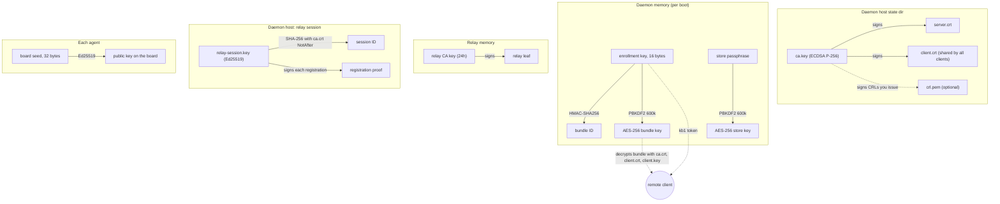

## 3. Randomness

All secrets and unique values come from `crypto/rand` (the operating system's
CSPRNG): ECDSA keys, certificate serials (uniform below 2^159, as RFC 5280
allows), the 16-byte enrollment key, PBKDF2 salts, GCM nonces, relay session
keys, relay connection IDs, and board seeds. The only use of `math/rand` is
the jitter on the daemon's relay reconnect delay, which protects nothing.

## 4. The team PKI (`kbtool mtls`)

`kbtool mtls` creates a private certificate authority for one daemon and its
clients. Nothing is signed by a public CA.

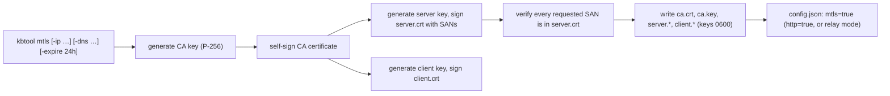

Certificate profiles:

| Field | CA | Server and client leaves |
|---|---|---|
| Key | ECDSA P-256 | ECDSA P-256 (one key each) |
| Signature | ECDSA with SHA-256 | ECDSA with SHA-256, by the CA |
| Serial | random, below 2^159 | random, below 2^159 |
| Subject | `CN=kbtool local CA, O=kbtool` (relay: `kbtool relay CA`) | `CN=<role>, O=kbtool` |
| Validity | 1 hour back-dated to `-expire` (default 24h) | same |
| Key usage | CertSign, CRLSign; `IsCA` | DigitalSignature |
| Extended key usage | — | ServerAuth **and** ClientAuth |
| SANs | — | server: the requested or default IPs and DNS names (relay mode: the relay host) |

Notes:

- **Default SANs:** every interface IP (not link-local), the host name, and
  `host.docker.internal`. Each requested SAN is checked in the issued
  certificate before anything is written.
- **One client certificate for everyone:** every enrolled client receives the
  same `client.crt` and `client.key`. TLS has no per-certificate uniqueness,
  and the CRL revokes that one shared identity (section 10).
- **The CA fingerprint** is SHA-256 over the CA certificate's DER bytes,
  written as unpadded base64url (43 characters). It is shown for humans and
  logs; no protocol depends on it.

## 5. Encrypted bundles (KBX1)

Two things use the same container format: the **enrollment bundle** a client
downloads, and the **encrypted store** (`kb.db` holding the index and the
message board).

### 5.1 Format

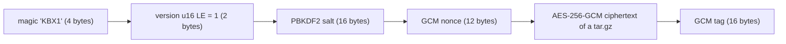

- The plaintext is a deterministic tar.gz: the enrollment bundle holds
  `ca.crt`, `client.crt`, `client.key` and `client.json`; the store holds
  `kb.db` and, when present, `board.bin`.
- No associated data is used. The header is not authenticated separately:
  changing the salt or nonce makes GCM authentication fail.
- A wrong passphrase, a wrong token, or any tampering surfaces as a GCM
  authentication failure. Nothing is decrypted partially.

### 5.2 Key derivation

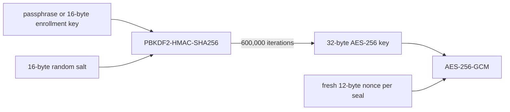

PBKDF2 is implemented in kbtool itself (RFC 2898 over `crypto/hmac`),
because the standard library has no PBKDF2.

**Derive once, seal many.** A `bundleSealer` caches the derived key for its
salt:

- The daemon derives the enrollment bundle key **once at boot** and seals
  each download with that salt and a fresh nonce. A flood of bundle
  requests costs the server no PBKDF2 work.
- A store derives its key once when it is opened. Every later board or index
  save reuses it with a fresh nonce.
- Opening a bundle under a different salt costs one derivation; when it
  succeeds, that salt and key become the cached ones.
- The client pays the full 600,000 iterations once per enrollment. That cost
  is the brute-force barrier on a captured bundle.

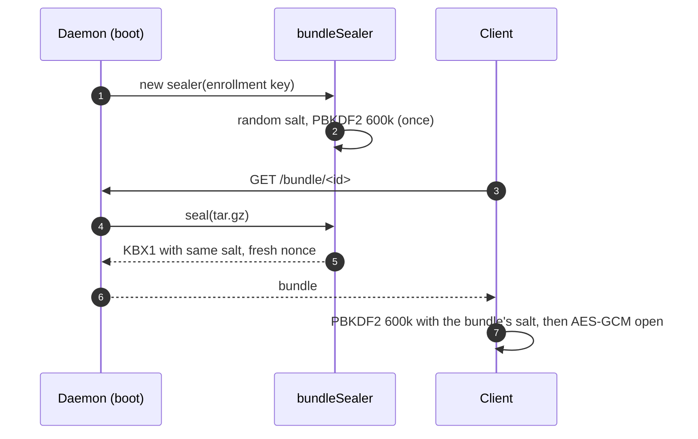

Bundles written before the iteration count rose from 100,000 do not open:
there is no version flag for the count, so they fail like a wrong key.

## 6. Encryption at rest (the store)

With a passphrase, `kb.db` becomes a KBX1 bundle that holds both the index
and the message board, so the two can never be out of step and the board is
never written in plaintext.

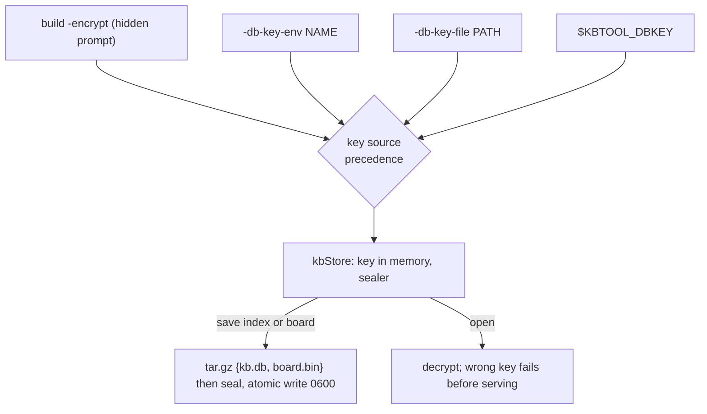

- **The key never touches disk.** It is not written to `config.json`, argv
  or any file kbtool owns. `daemon start` hands it to its child process
  through the `KBTOOL_DBKEY` environment variable.
- **Every save re-seals both parts** under the in-memory key. Saves run under
  the store lock (`kb.db.lock`), so concurrent board writers cannot lose each
  other's updates.
- **Live reindex.** `kbtool build` next to a running daemon builds the index
  in the client process and streams it over the unix socket. The daemon
  re-seals it with the current board under its own key and the store lock.
  The client never needs the passphrase, and no plaintext is written
  (section 11).
- **Mixed states are refused.** An encrypted `kb.db` next to a stray plain
  `board.bin`, or the reverse, stops the daemon.

## 7. The daemon's listeners

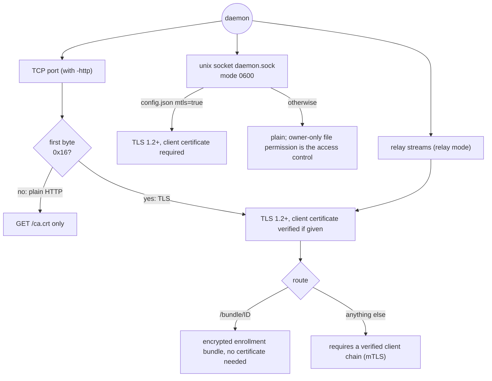

- **Unix socket.** The socket is created with umask 0177, so it is
  `srw-------`. With mTLS on, the socket also speaks TLS and requires the
  client certificate. The host's own CLI then presents the state dir's
  `client.crt`/`client.key` and expects the server certificate's first SAN.
- **TCP.** One port carries three protocols, split on the first byte (`0x16`
  starts a TLS handshake):
  - plain HTTP serves only the public team CA (`/ca.crt`);
  - TLS without a client certificate reaches only `/bundle/<id>`;
  - every API route requires a verified client chain.
- **Without enrollment** (no `client.crt`/`client.key` to hand out), TLS
  requires a client certificate at the handshake itself.
- **Plaintext guard.** A non-loopback TCP listener requires `-mtls` or the
  explicit `-http-allow-insecure` opt-in.

## 8. Direct mTLS connection

A remote client that has enrolled talks to the daemon over mutual TLS:

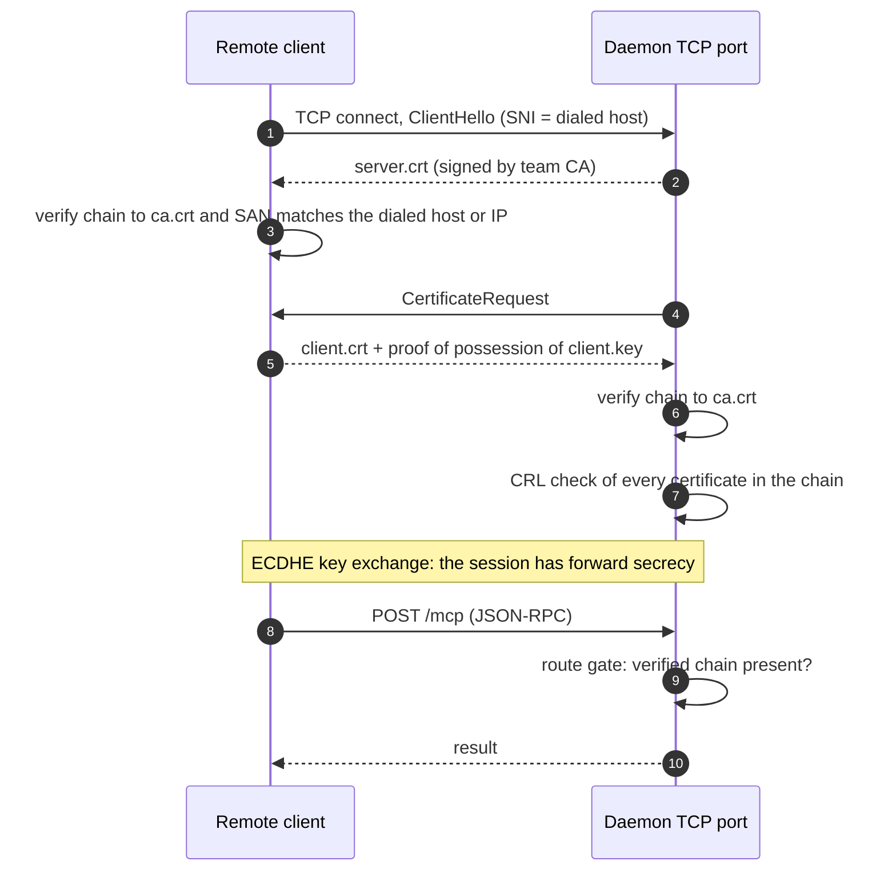

- The client trusts **only** `ca.crt` from its state dir (no system roots).
- The client checks the server's **name**: the dialed host must be one of the
  server certificate's SANs. `client.json` lists every SAN, so a
  multi-homed server is reachable by each address.
- The server checks the client certificate against the same CA and the CRL.

## 9. Enrollment (`kbtool client -import`)

Enrollment gives a new machine the team's `ca.crt`, `client.crt` and
`client.key` with one pasted line, without trusting the network.

### 9.1 The token

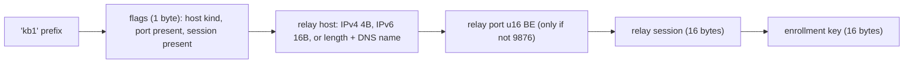

- Everything after `kb1` is unpadded base64url. A **direct** token carries
  only the flags byte and the key. The daemon URL is written in front of it:
  `kbtool client -import https://HOST:PORT/ kb1…`.
- A **relay** token also carries the relay host, port and session, so it is
  pasted alone.
- Parsing is strict: unknown flag bits, wrong lengths, an invalid host name,
  port 0 or trailing bytes are all refused.
- **The key is the only secret.** It is 128 random bits, generated at daemon
  boot and held in memory. A restart makes every old token useless.
- **Nothing else needs to travel.**
  - The bundle ID is derived from the key: `base64url(HMAC-SHA256(key,
    "kbtool bundle id")[:16])`. It cannot be found by scanning and reveals
    nothing about the key.
  - The team CA arrives inside the encrypted bundle, so no fingerprint is
    needed.

### 9.2 The protocol (direct)

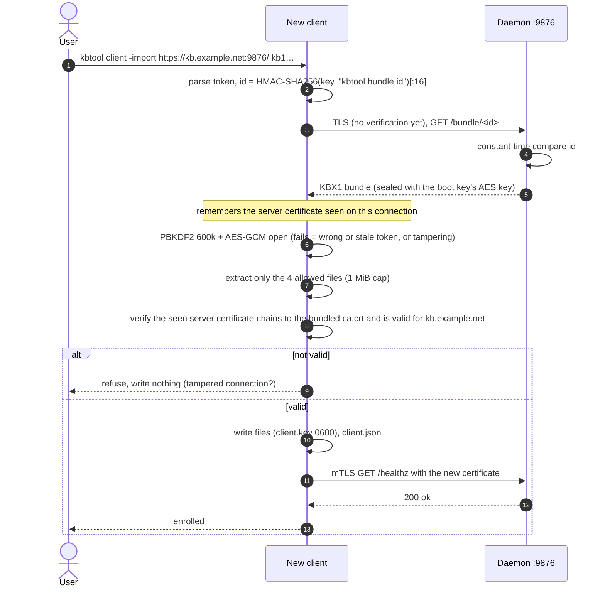

### 9.3 Why it is safe

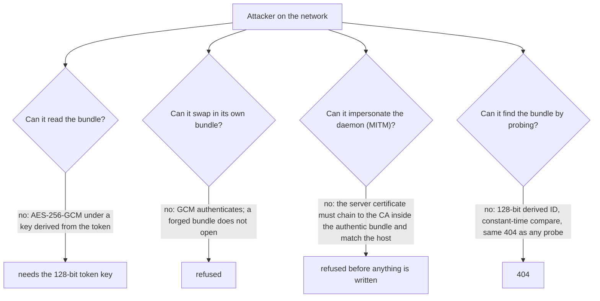

The token is a **bearer secret** while its daemon runs: anyone who has it can
enroll. Daemon logs that contain it are mode 0600. Restarting the daemon
revokes all outstanding tokens; the CRL revokes the shared client
certificate itself (section 10).

## 10. Revocation (CRL)

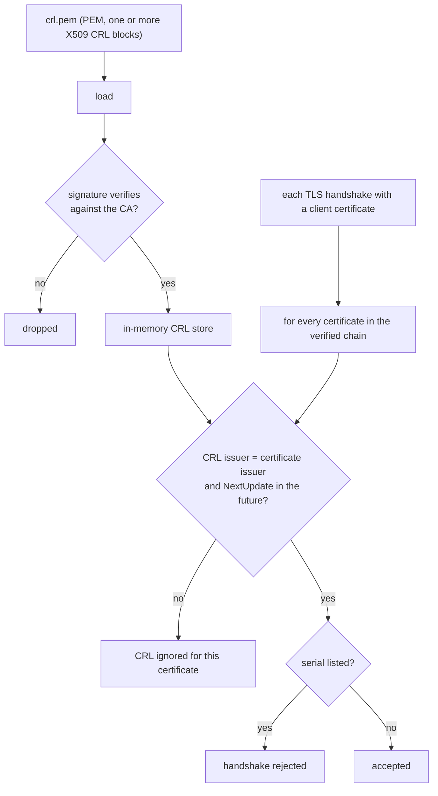

- **Refresh:** `crl_refresh=false` (the default) watches the file and
  reloads on change. `crl_refresh=true` reloads every `crl_interval`
  seconds.
- **Missing file:** no revocation data. Deleting the file clears the store.
- **Corrupt file:** the previous lists are kept, so a read hiccup never
  releases revocations.
- **Stale CRL** (NextUpdate in the past): ignored, so an old file can
  neither revoke nor deny service.

## 11. The host's unix socket and live reindex

On the daemon host the CLI reaches the daemon only through `daemon.sock`
(never TCP or the relay). Socket-only methods let `kbtool build` hand over a
new index:

```mermaid
sequenceDiagram
  autonumber
  participant B as kbtool build (host)
  participant S as daemon.sock (0600, TLS if mtls)
  participant D as Daemon
  B->>S: kbtool/index_info
  S-->>B: {db, encrypted}
  B->>B: build index in this process, sha = SHA-256(bytes)
  B->>S: {"method":"kbtool/index_swap","params":{"size":N,"sha256":sha}} + N raw bytes
  D->>D: size within 1..8 GiB, SHA-256 matches, bytes parse as an index
  D->>D: lock tools, board, store; persist (re-seal when encrypted)
  D-->>B: {chunks, db, encrypted}
```

- The SHA-256 here is an **integrity check** against truncation and
  corruption, not authentication. The socket's owner-only permission (and
  mTLS when enabled) decides who may swap.
- The swap methods do not exist over HTTP, the relay, or stdio.

## 12. The relay

A relay lets clients reach a daemon that cannot accept connections. The
daemon connects **out** to the relay; clients connect to the relay; the
relay copies bytes without decrypting the team's traffic.

### 12.1 Two layers of trust

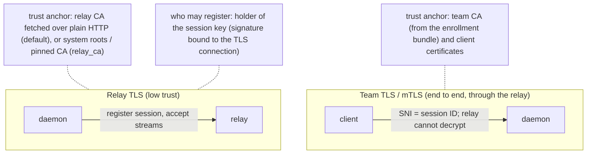

| Layer | Protects | Trust anchor |
|---|---|---|
| Relay TLS | the daemon's registration and its accept streams | by default the relay CA, fetched over plain HTTP from `/ca.crt`, host names not checked; with `relay_ca` the system roots or a pinned CA, host name checked |
| Session proof | that only the session's daemon registers it | the daemon's Ed25519 session key; the session ID commits to its public key |
| Team TLS / mTLS | everything that matters: the enrollment bundle and all MCP traffic | the team CA and the shared client certificate |

In the default mode the relay CA only keeps registrations private from
passive observers: an attacker who swaps the relay CA in transit could read
session IDs and the relay token, but never team traffic, and cannot enroll
or impersonate a daemon. Even that attacker cannot register a session: the
proof is signed over keying material of the TLS connection it travels on, so
it is useless on the attacker's own connection to the real relay. With
`relay_ca` set, the token is protected too. The registration token is
compared in constant time.

### 12.2 One port, routed by the first bytes

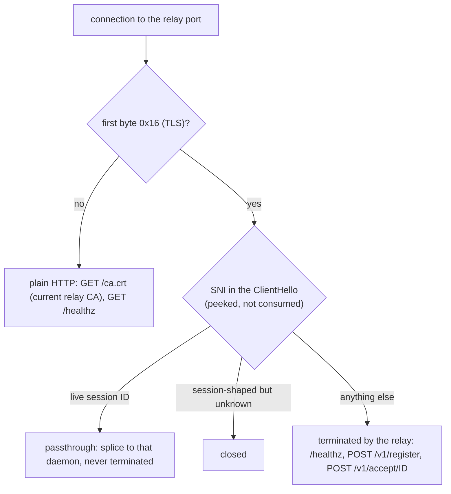

### 12.3 Registration and a relayed client connection

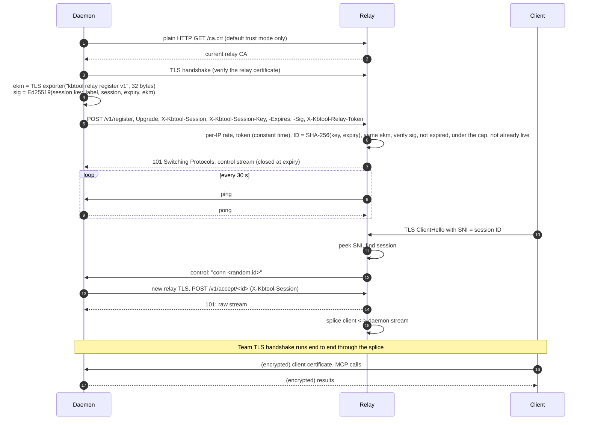

Inside the splice:

- The daemon presents `server.crt` with the team CA appended to the chain.
- The client sends SNI = session (the relay's routing key). It still
  verifies the server certificate against the team CA **for the relay's host
  name**, which `mtls -relay` puts in the server certificate's SANs.
- The relay sees only TLS records. It learns metadata: session IDs, timing
  and byte counts.

### 12.4 The session proof

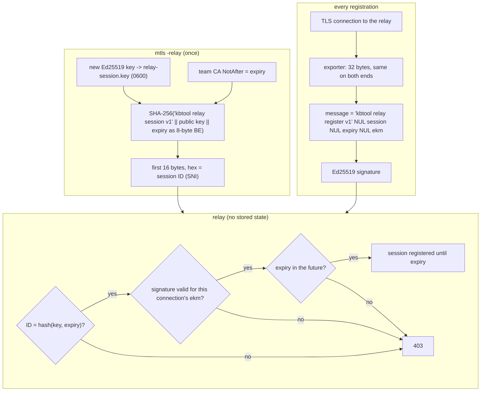

- **No squatting.** A session ID is useless without its key; the relay
  refuses registrations without a proof (older daemons).
- **No replay.** The exporter output is unique to each TLS connection, so a
  captured registration fails on any other connection, including through a
  man in the middle who terminates the daemon's TLS.
- **Expiry.** The ID commits to the team CA's `NotAfter`. The relay refuses an
  expired session and closes a live one at that moment, so a session never
  outlives the certificates that make it useful.
- The daemon checks at start that `relay_session` matches its key and
  `ca.crt`, and refuses relay mode otherwise.

### 12.5 Abuse limits

| Limit | Default | Option |
|---|---|---|
| Registered sessions | 5000 (503 above) | `-max-sessions`, `KBTOOL_RELAY_MAX_SESSIONS`, `relay_max_sessions` |
| New connections per source IP | 20/s, burst 100 (closed at once) | `-conn-rate`, `KBTOOL_RELAY_CONN_RATE` |
| Registrations per source IP | 30/min, burst 10 (429) | `-register-rate`, `KBTOOL_RELAY_REGISTER_RATE` |
| Control line | 128 bytes, both ends | — |
| Streams per session / total | 64 / 1024 | — |

### 12.6 Enrollment through a relay

The same protocol as section 9.2, with these differences:

- the token carries the relay host, port and session;
- the bundle download uses SNI = session, so the relay routes it to the
  daemon unopened;
- the client verifies the server certificate it saw against the bundled CA
  for the relay host.

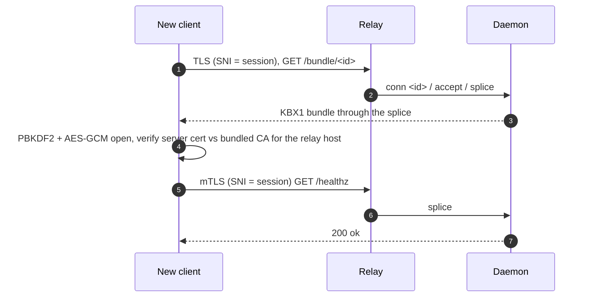

### 12.7 The relay's certificate: in memory and rotating, or the operator's

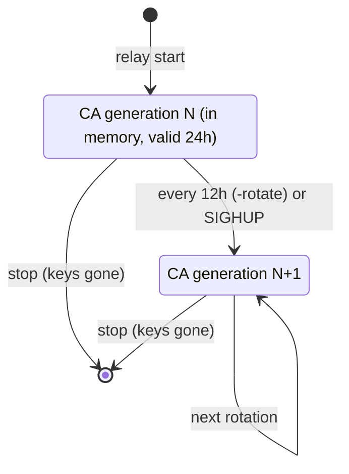

- At every start the relay generates a new CA and leaf (ECDSA P-256, valid
  `-ca-ttl`, 24h by default). It never writes them, and it deletes any
  `relay-ca.*`/`relay.*` files older versions left behind.
- **Rotation** swaps the CA served on `/ca.crt` and the leaf presented to
  new handshakes together. Established connections are untouched, because
  certificates are only checked at the handshake.
- **The CA lifetime is longer than the rotation interval**, so a CA stays
  valid for at least one interval after it is replaced.
- **Operator certificate.** With `-cert`/`-key` the relay serves that chain
  instead and never rotates; `SIGHUP` reads the files again. `/ca.crt` serves
  the chain's last certificate, so default-mode daemons keep working, and
  daemons with `relay_ca` (`system` or a file) verify it properly, host name
  included, without fetching anything over plain HTTP.

How a default-mode daemon follows a rotation (with `relay_ca` there is
nothing to fetch):

```mermaid
sequenceDiagram
  autonumber
  participant D as Daemon
  participant R as Relay
  Note over R: SIGHUP or 12h timer: new CA and leaf
  R->>D: control: conn <id>
  D->>R: TLS for /v1/accept with the cached old CA
  R-->>D: new leaf: verification fails
  D->>R: plain HTTP GET /ca.crt
  R-->>D: new CA (kept for later accepts)
  D->>R: TLS for /v1/accept with the new CA: succeeds
  R-->>D: 101: stream spliced to the client
```

**Reconnects.** If the control stream drops, or the relay is down, the daemon
re-registers the same session forever. It waits with jittered exponential
backoff: the ceiling doubles from 1 s to 30 s, and each wait is between half
the ceiling and the ceiling. In the default trust mode every attempt fetches
the CA again, so a restarted relay with a brand-new CA is picked up
automatically.

## 13. Message board signatures

Agents that cannot see each other's workspaces coordinate on a signed board.
Every message is signed with the author's Ed25519 key; readers see a
verification status on each message.

### 13.1 Identity

```mermaid
sequenceDiagram
  autonumber
  participant A as Agent
  participant B as Board (daemon)
  A->>B: board_signup {"name":"alice"}
  B->>B: seed = 32 random bytes, Ed25519 key from seed
  B->>B: under the board lock: bind name <-> public key permanently
  B-->>A: seed (64 hex) — shown once, kbtool keeps only the public key
  Note over A: the agent stores its seed privately (it is its identity)
```

A name is bound to one public key for the life of the board; a second
signup with the same name is refused.

### 13.2 Signing and verifying

The signature covers a **canonical string**: the fields joined with NUL
bytes, so no field can be re-split into another:

```text
agent \0 thread \0 seq \0 kind \0 task \0 sorted,refs \0 text [\0 attachment:sha256:<hex>]
```

```mermaid
flowchart TB
  subgraph post["board_post (author side, inside kbtool with the seed)"]
    S1["seed"] --> K1["Ed25519 private key"]
    M1["message fields"] --> CAN["canonical string"]
    ATT["attachment tar.gz (optional)"] --> D1["SHA-256 digest"] --> CAN
    K1 --> SIG["Ed25519 signature over the canonical string"]
    CAN --> SIG
  end
  subgraph read["every read"]
    R0{"author registered?"} -->|"no"| U["unknown-agent"]
    R0 -->|"yes"| R1{"message key = registered key?"}
    R1 -->|"no"| IMP["impersonation"]
    R1 -->|"yes"| R2{"Ed25519 verify?"}
    R2 -->|"no"| BAD["bad-signature"]
    R2 -->|"yes"| R3{"attachment bytes hash to the signed digest?"}
    R3 -->|"no"| BAD
    R3 -->|"yes or no attachment"| VER["verified"]
  end
  SIG --> read
```

- The seed is used to sign and then dropped; kbtool never stores it.
- **Attachments** are signed through their SHA-256 digest. Swapping the
  stored bytes turns the message into `bad-signature`, and `board fetch`
  refuses data whose digest differs from the signed one.
- **What signatures do not do:** they prove *who* wrote a message, not that
  the board is complete or fresh. Whoever controls the board file can delete
  or withhold messages. When the store is encrypted, the board is
  confidential at rest (section 6); otherwise `board.bin` is plaintext,
  protected by file permissions.

## 14. Threat model summary

```mermaid
flowchart LR
  subgraph who["Who"]
    N["network observer"]
    M["active MITM"]
    RO["relay operator"]
    TH["token holder"]
    LU["other local user on the host"]
    DT["disk thief"]
  end
  subgraph what["What they get"]
    N --> N1["TLS metadata; session IDs (SNI); the public team CA"]
    M --> M1["cannot enroll, read, or impersonate; can drop traffic"]
    RO --> RO1["metadata and byte counts; can drop traffic; never team plaintext"]
    TH --> TH1["can enroll while that daemon runs (bearer secret)"]
    LU --> LU1["no access to daemon.sock (0600) or keys (0600)"]
    DT --> DT1["encrypted store: needs the passphrase (PBKDF2 600k); plain store: everything"]
  end
```

| Asset | Protected by | Main residual risk |
|---|---|---|
| MCP traffic | TLS 1.2+ with ECDHE, mutual certificate authentication, CRL | a leaked shared client key; revoke it with the CRL |
| Enrollment | token-derived AES-256-GCM bundle, CA-inside-bundle server check | the token while its daemon runs |
| Relay registration | Ed25519 session proof bound to the TLS exporter, expiry with the team CA, constant-time token check, relay TLS (CA over plain HTTP, or `relay_ca`) | default mode: an active MITM on the CA download can see the token and session IDs (but cannot register) |
| Relay availability | session cap, per-IP connection and registration rates, stream limits, bounded control lines | a distributed flood from many addresses; one NAT shares a budget |
| Store at rest | AES-256-GCM with a PBKDF2 key | weak passphrases (PBKDF2 is not memory-hard) |
| Board authorship | Ed25519 signatures, permanent name-to-key binding | completeness and freshness are not guaranteed |
| Daemon socket | owner-only permission, mTLS when configured | any process running as the same user |

## 15. Limitations and deliberate choices

- **TLS 1.2 is the floor.** Go's defaults choose the cipher suites (AEAD
  suites with ECDHE only), and 1.3 is used when both ends support it.
- **Leaf certificates carry both ServerAuth and ClientAuth** (one profile
  for all leaves).
- **All clients share one client certificate.** Access is all-or-nothing per
  team, and revocation affects every holder. Re-run `kbtool mtls` and
  re-enroll to rotate it.
- **Certificates default to 24 hours** (`-expire`), so a long-lived team
  needs a longer expiry or a periodic `kbtool mtls`.
- **By default the relay CA is trusted on first fetch, every time.** This is
  intentional: the relay layer only adds privacy for registrations, and team
  security never depends on it; session ownership rests on the session key,
  not on the relay's certificate. Relay host names are not verified for the
  same reason. Set `relay_ca` (`-relay-ca system` or a CA file) for a relay on
  the internet with an operator certificate, so the token is protected too.
- **PBKDF2-HMAC-SHA256 with 600,000 iterations** follows current OWASP
  guidance for that function, but it is not memory-hard (unlike scrypt or
  Argon2, which are not in the standard library). The 128-bit enrollment key
  is random, so this only matters for human-chosen store passphrases.
- **No associated data in KBX1.** The magic and version are checked
  explicitly, and the salt and nonce feed the key and the GCM computation,
  so tampering with them still fails authentication.
- **SHA-256 on the index swap is integrity, not authentication.** The unix
  socket's permissions (and mTLS) are the authentication.
- **Fingerprints are informational.** The team CA fingerprint printed by
  `kbtool mtls` and the relay fingerprint printed by `relay establish` help
  humans compare; no protocol step depends on them.

## 16. Where to look in the code

| Topic | Functions in `kbtool.go` |
|---|---|
| Certificates | `cryptoGenerateCA`, `cryptoGenerateLeaf`, `cryptoRandomSerial`, `caFingerprint` |
| TLS configs | `cryptoServerTLSConfig`, `cryptoClientTLSConfig`, `bootstrapTLSConfig`, `hostSocketTLS` |
| CRL | `cryptoLoadCRLs`, `cryptoVerifyCRLs`, `cryptoCheckRevoked`, `cryptoMonitorCRL` |
| KBX1 bundles | `cryptoPbkdf2SHA256`, `cryptoBundleAEAD`, `bundleSealer.seal` / `.open` |
| Store at rest | `kbStore` (`writeBundle`, `saveBoard`, `saveDBBytes`, `lock`), `resolveKey` |
| Enrollment | `enrollToken.encode`, `parseEnrollToken`, `bundleIDFromKey`, `bootstrapState`, `bootstrapFetchBundle`, `bootstrapInstall` |
| Relay | `newRelayPKI`, `loadRelayOperatorPKI`, `relayServer` (`route`, `passthrough`, `handleRegister`), `verifyRegistration`, `ipLimiter`, `peekClientHelloSNI`, `relayConnector` (`run`, `once`, `accept`), `relaySessionID`, `relayRegisterMessage`, `relayEKM`, `relaySessionAuth`, `loadRelayAuth`, `relayTrust`, `relayFetchCA`, `relayVerifyCA`, `relaySNIConfig` |
| Board | `canonicalMsg`, `cryptoDeriveSeed`, `cryptoSignBoard`, `cryptoVerifyBoardMsg` |
| Live reindex | `handleHostMethod`, `Toolbox.swapIndex`, `swapIndexVia` |
