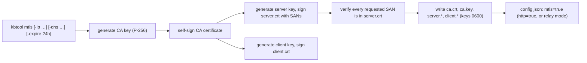
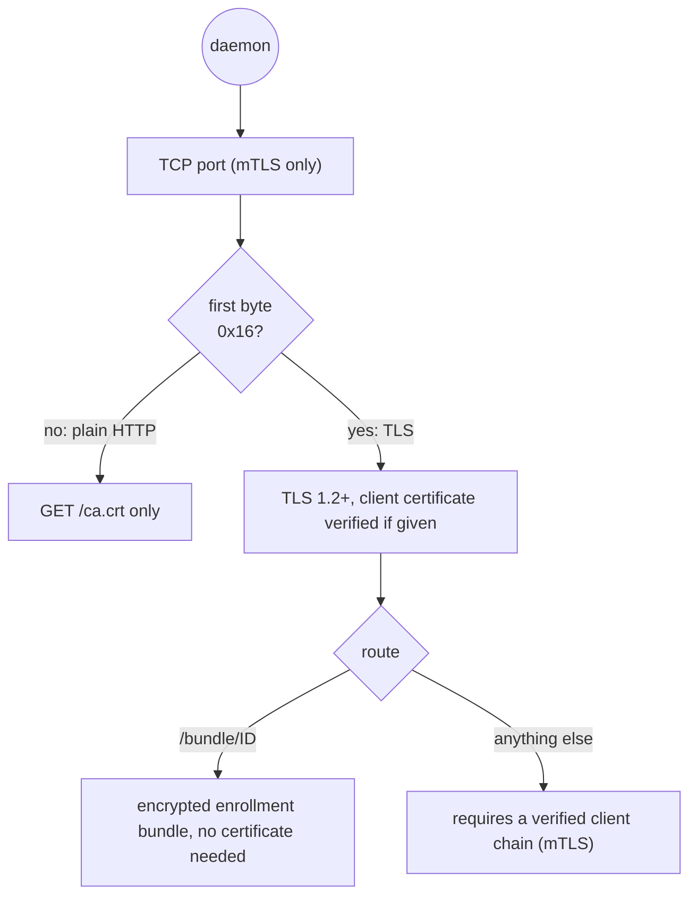
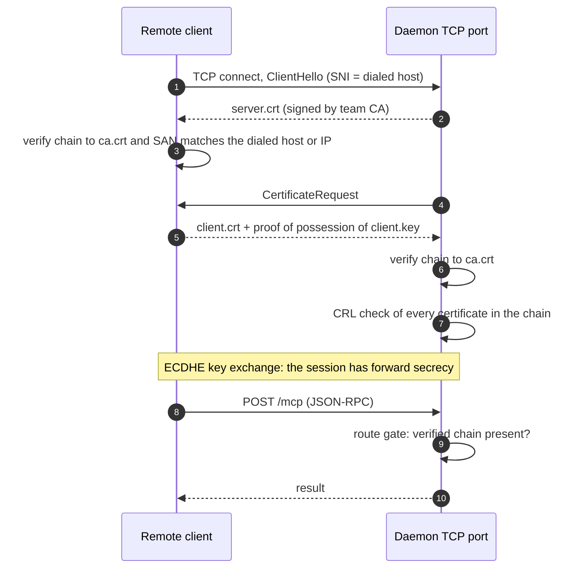
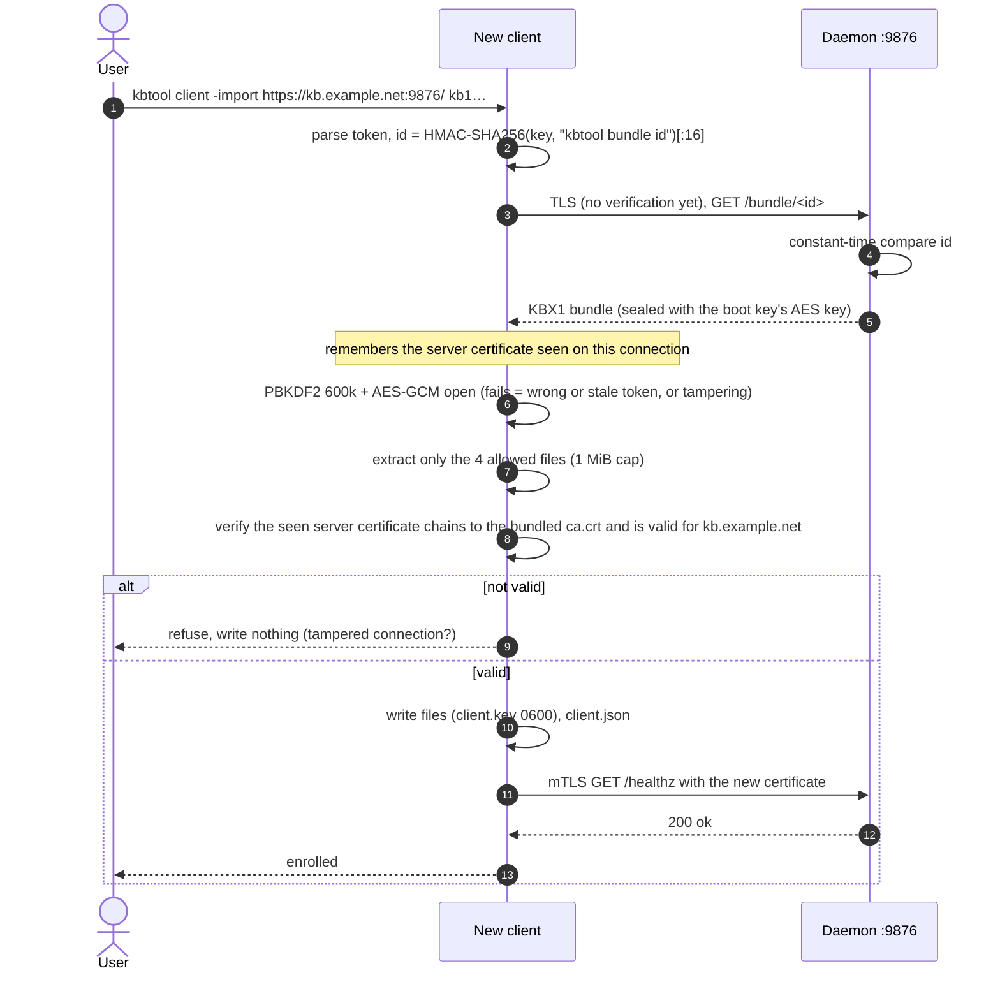

# Cryptography in kbtool — snapshot builds

Applies to snapshot builds only (`make release-snapshot` or `go build`); release builds refuse these commands and options.

[../cryptography.md](../cryptography.md) describes every piece of
cryptography kbtool uses. Snapshot builds add ways to run kbtool without a
session, each with its own trust setup:

- the team PKI issued by hand (`kbtool mtls`, [mtls.md](mtls.md));
- direct mode: the daemon's own HTTPS port (`daemon start -http -mtls`, or
  a direct session, `collaborate host -ip/-dns`);
- enrollment without a session (`kbtool client -import`,
  [client.md](client.md)), including the direct `https://HOST:PORT/ kb1…`
  form;
- CRL options;
- the store and the board without a session.

This page covers only those additions. Section numbers in parentheses refer
to [../cryptography.md](../cryptography.md).

## 1. The team PKI by hand (`kbtool mtls`)

`kbtool mtls` creates the same private certificate authority a session host
creates (section 4), outside a session and with the SANs you choose. A
direct session (`collaborate host -ip/-dns`) issues it the same way.

- **SANs:** the requested IPs and DNS names. With none given: every
  interface IP (not link-local), the host name, and `host.docker.internal`.
  In relay mode (a `relay.json` with relays enabled) every joined relay host
  comes first, as in a session. Each requested SAN is checked in the issued
  certificate before anything is written.
- **Bind address:** without relays, exactly one IP (and no DNS name) makes
  that IP the daemon's TCP bind address; otherwise the daemon binds
  dual-stack on `:9876`. Relay mode opens no TCP port.
- **Keys and lifetime:** `ca.key`, `server.key` and `client.key` (and, in
  relay mode, `relay-session.key`) live until the next `kbtool mtls`. The
  relay session ID changes with every `mtls`.
- **Rotating the shared client certificate:** re-run `kbtool mtls` and
  re-enroll every client. A long-lived team needs a longer `-expire` or a
  periodic `kbtool mtls`.
- **Fingerprint:** `kbtool mtls` prints the team CA fingerprint for humans
  to compare; no protocol step depends on it.

## 2. The daemon's TCP port (direct mode)

With `daemon start -http -mtls` (or a direct session) the daemon listens on
a TCP port as well as its unix socket and relay streams (section 7):

- **TCP.** One port carries three protocols, split on the first byte (`0x16`
  starts a TLS handshake):
  - plain HTTP serves only the public team CA (`/ca.crt`);
  - TLS without a client certificate reaches only `/bundle/<id>`;
  - every API route requires a verified client chain.
- **Without enrollment** (no `client.crt`/`client.key` to hand out), TLS
  requires a client certificate at the handshake itself.
- **No plain-HTTP API.** The TCP port exists only with mTLS (`-http` without
  it refuses to start), so the API is never reachable without a client
  certificate.

## 3. Direct mTLS connection

A remote client that has enrolled with a direct daemon talks to it over
mutual TLS on that port:

- The client trusts **only** `ca.crt` from its state dir (no system roots).
- The client checks the server's **name**: the dialed host must be one of the
  server certificate's SANs. `client.json` lists every SAN, so a
  multi-homed server is reachable by each address.
- The server checks the client certificate against the same CA and the CRL.

## 4. Enrollment without a session (`kbtool client -import`)

`kbtool client -import kb1…` enrolls with a relayed daemon exactly like
`collaborate attend` (section 9), without creating a session.

A **direct** token carries only the flags byte and the key. The daemon URL
is written in front of it: `kbtool client -import https://HOST:PORT/ kb1…`
(or `collaborate attend|resume https://HOST:PORT/ kb1…` for a direct
session). The protocol:

The safety argument (section 9.3) is the same, with the dialed daemon host
in place of the relay host.

## 5. CRL options

The daemon's revocation check (section 10) reads `config.json` `crl_file`
(`crl.pem` in the state dir by default). `daemon run|start` can change how
it is loaded:

| Flag | Config | Effect |
|---|---|---|
| `-crl FILE` | `crl_file` | the CRL PEM file (it may not exist) |
| `-crlrefresh` | `crl_refresh` | `false` (the default) watches the file and reloads on change; `true` reloads every `crl_interval` seconds |
| `-crlinterval SEC` | `crl_interval` | the reload period with `-crlrefresh` (default 60) |

## 6. The store and the board without a session

- **Store key.** `kbtool build -encrypt` (hidden prompt), `-db-key-env` or
  `-db-key-file` write an encrypted store without a session (section 6).
  `daemon start` hands the key to its child process through the
  `KBTOOL_SECRET` environment variable.
- **Live reindex.** `kbtool build DIR…` next to a running daemon swaps the
  index over the unix socket like a session's `kbtool build` (section 11).
- **Board seeds.** Outside a session there is no session layer: a raw
  `board_signup` (outside a session, or an MCP client wired straight to the
  daemon's HTTP endpoint) returns the seed once to the agent, which must
  keep it itself, and every signing call carries it. `kbtool board signup`
  then writes it to `-seed-file` (default `./.kbtool-seed`, mode 0600); see
  [board.md](board.md). The seed then lives wherever the agent stores it,
  in plain text.

## 7. Randomness

`kbtool bench` samples queries with `math/rand` from a seed you give it; it
protects nothing.
